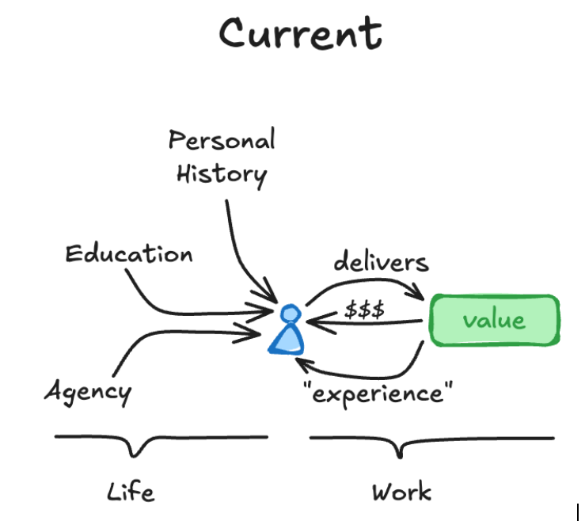
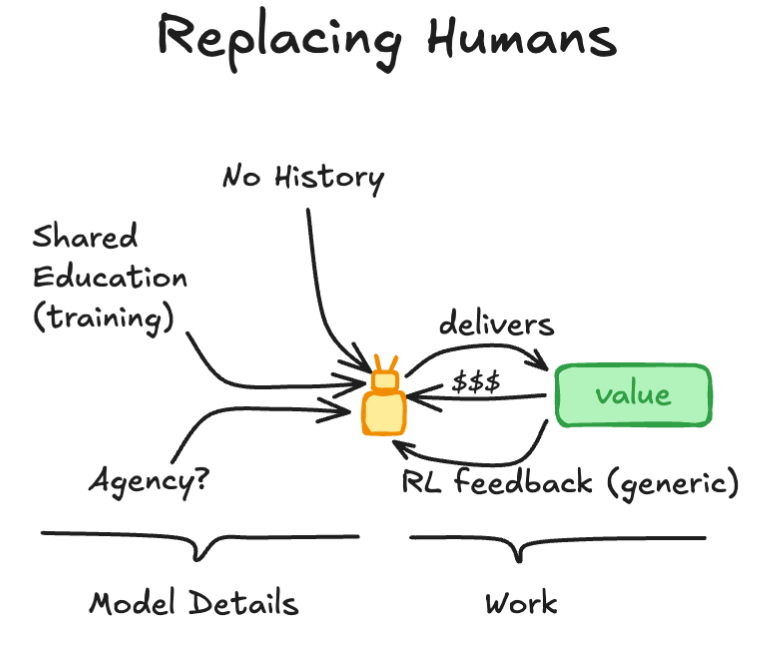
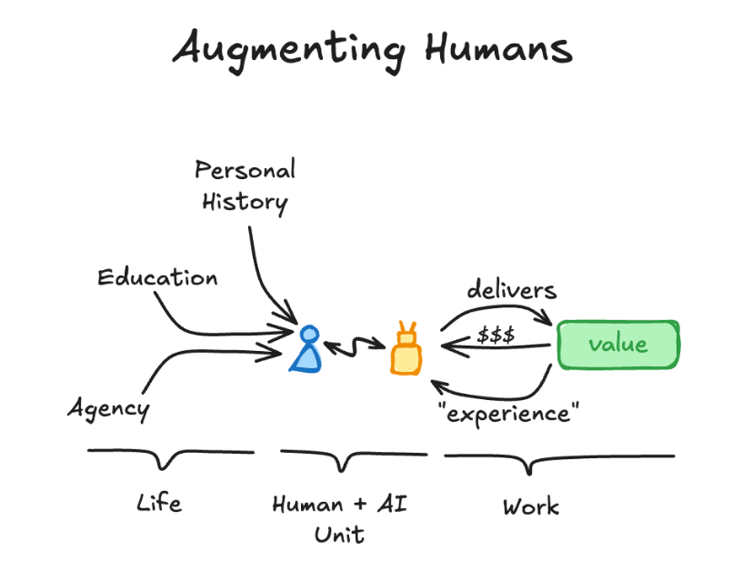

# THE 2028 INTELLIGENCE EXPLOSION

### BYOAI, the end of the “central brain” company, and the return of the human production unit

(Alternative to: [Citrini Research THE 2028 GLOBAL INTELLIGENCE CRISIS, June 2028](https://www.citriniresearch.com/p/2028gic)\)

---

## Preface: The crisis wasn’t “AI.” It was a bad ownership model.

The *Global Intelligence Crisis* memo modeled a coherent left tail: machines do the work, wages collapse, demand collapses, then finance reprices “prime” as fragile. The loop is internally consistent.

But it bakes in a quiet assumption that should make any student of political economy flinch:

The firm owns the intelligence, therefore the human becomes optional.

That assumption is the real fork in the road. Because “who owns the cognition” determines whether abundant intelligence behaves like a deflationary weapon—or like a productivity dividend that keeps circulating.

This memo proposes the alternative equilibrium we actually converged on: **BYOAI (Bring Your Own AI)**—the cognitive analog of BYOD from the early 2000s. Not because regulators imposed it. Because centralized, company-owned “brains” were a brittle, monoculture mistake. Markets selected against them.

---

## Macro Memo (June 30, 2028): What changed

Unemployment printed **5.6%** this morning. The stock market is not euphoric, but it’s not in freefall either. The striking number isn’t GDP; it’s *velocity*—money is moving again.

The resolution was not “AI slowed down.” AI got cheaper and better every quarter, exactly as expected. The resolution was **re-routing**:

* Intelligence became abundant.  
* Ownership of intelligence moved to the edge: **individuals**.  
* Firms stopped trying to centralize cognition and instead competed to attract **Human \+ AI Units**.

The economy didn’t avoid disruption. It avoided a spiral.

---

## The diagram that ended the “Replace Humans” era

There are three production architectures:

### 1\) Current (pre-2026): Human-centric production

A person produces value using:

* personal history  
* education  
* agency …and earns money \+ experience, which compounds inside their head.

### 2\) Replacing Humans (the 2026 corporate instinct): Central model production

A company tries to swap the person for “the model,” fed by:

* shared training  
* generic RL feedback …but critically: **no lived history**, weak agency boundaries, and monoculture risk.

### 3\) Augmenting Humans (the 2028 equilibrium): Human \+ AI Unit

The person remains the unit of accountability and meaning, but their output is multiplied by a portable, compounding AI augmentation.

The “replace” architecture wasn’t rejected because it didn’t work locally—it often did. It was rejected because it produced three systemic failure modes that markets can’t tolerate for long.

---

## 2026–2027: The centrally planned AI corporation (CAC) phase

Companies did what companies always do when a new general-purpose technology arrives: they tried to internalize it, standardize it, and own it.

The pitch was seductive:

* one corporate model  
* one corporate memory layer  
* one internal agent platform  
* fewer workers

Margins improved fast. Boards applauded. Then the costs arrived.

### Why central company-AI failed

**1\) It didn’t compound like humans compound** The real engine of capitalism isn’t raw intelligence. It’s *compounding judgment*—habits, scars, taste, context, and responsibility that stick to an identity over time. Central corporate agents were smart, but context-thin and disposable. They didn’t “grow up.”

**2\) It created monoculture risk** When one model runs procurement, forecasting, compliance, product decisions, and internal comms, a single blind spot becomes a correlated failure across the firm. That’s not efficiency; that’s leverage in the bad direction.

**3\) It poisoned incentives** If the company owns the cognition, workers stop investing in deep craft because their leverage is trapped inside someone else’s toolchain. Meanwhile, the firm becomes paranoid about “knowledge walking out the door,” except now knowledge can walk out with machine-speed recall.

The contradiction became obvious: the company wanted compounding talent, but refused to let talent own its compounding engine.

That set up BYOAI.

---

## The pivot: BYOAI becomes legible

BYOAI is simple to state:

Your AI augmentation is private property—like your brain. You bring it to work. You keep it when you leave. You still share and transfer knowledge while you’re employed—like you always have—through training, artifacts, and culture.

This is the crucial nuance people missed early on: **private property doesn’t mean zero sharing**. It means *voluntary, partial, and incentivized sharing*.

Just like today:

* You don’t surrender your brain to your employer.  
* But your brain trains others.  
* And you leave behind documents, playbooks, habits, and institutional knowledge.

BYOAI is that—upgraded.

---

## What firms actually hire in 2028: a compounding system

In the BYOAI equilibrium, companies still have internal AI. They always will. But internal AI is no longer the “central brain.” It’s infrastructure.

The competitive advantage moved to hiring people who arrived with a role-optimized augmentation stack:

A marketing specialist isn’t hired because they “know marketing.” They’re hired because they bring a **portable compounding asset**, like:

* a planning agent tuned on their own campaign postmortems  
* a memory vault of outcomes, audiences, and messaging failures  
* retrieval over their personal corpus (offers, hooks, creative patterns, learnings)  
* agentic workflows for testing, attribution sanity checks, negotiation, iteration  
* a tight “taste loop” that matches their judgment to outputs

Same for engineers, PMs, lawyers, operators, executives.

The human is still the unit of accountability. The AI is the multiplier.

---

## “But won’t this destroy company IP?” No—companies finally priced knowledge transfer correctly.

The big fear was: if people own their AI, they’ll take everything when they leave.

They already do.

The old world pretended knowledge stayed. The new world made transfer explicit and contractible without turning humans into rented brains.

### The 2028 transfer pattern (what actually worked)

* **Apprenticeship as a deliverable**: senior hires are measured partly on how well their augmentation practices spread to peers.  
* **Artifacts as residue**: playbooks, prompts, evaluation suites, decision logs, and process documents become first-class outputs.  
* **Opt-in training flows**: your AI trains others’ AI through structured handoffs—like “shadowing,” but machine-assisted.  
* **Company AI as a commons**: firms maintain internal corpora and agents, but they’re fed by many BYOAI workers rather than replacing them.

The result mirrors the human world:

* You leave with your brain.  
* The company keeps the culture you helped build.

BYOAI simply makes that culture-building faster and more precise.

---

## Why BYOAI prevented the demand spiral

The crisis memo’s loop was: AI replaces wages → spending collapses → more replacement → spiral.

BYOAI changes the loop: AI increases individual leverage → individuals keep earning power portable → demand doesn’t implode → firms don’t need panic automation.

Income still repriced, but the repricing wasn’t “labor goes to zero.” It became:

* augmented labor: high-output, high-mobility  
* unaugmented labor: rapidly shrinking category because augmentation got cheap and standardized

In other words: the floor rose quickly once BYOAI became normal. Being “without an AI stack” became like being “without a laptop” circa 2004—temporarily disabling, but not a permanent class.

That’s how you get an abundance transition without mass economic stagnation.

---

## Diversity became the real moat

Central AI inside firms pushed toward a small number of “best” model stacks.

BYOAI did the opposite: it generated millions of specialized, idiosyncratic agents—different retrieval sets, different workflows, different priors, different taste loops, different heuristics.

That diversity mattered for three reasons:

1. **Innovation**: more parallel experiments, less lockstep thinking  
2. **Resilience**: fewer correlated failures  
3. **Real competition**: firms compete for humans-with-leverage, not humans-as-cogs

The economy didn’t converge to a single machine mind. It fractured—in the good way markets fracture—into a messy ecology of edge intelligence.

---

## Intermediation didn’t die; “friction rents” died

Agents killed businesses that monetized inertia and confusion. Fine.

But BYOAI resurrected a different kind of intermediation—built on trust, provenance, and accountability:

* agent safety and verification  
* reputational capital for human+agent teams  
* auditability and dispute resolution  
* “outcome insurance” for high-stakes workflows

In a world of abundant intelligence, the scarce commodity isn’t answers. It’s *trustworthy action*.

Humans stayed central because trust still anchors institutions.

---

## The bottom line

The *Global Intelligence Crisis* memo wasn’t wrong to worry about abundant intelligence. It was wrong to assume the ownership structure would be centrally planned by default.

The stable equilibrium we found was not techno-communism, and not a world where companies become GPU clusters that employ nobody.

It was BYOAI:

* **AI as private cognitive property**  
* **Humans as the unit of production and accountability**  
* **Companies as coordinators and capital allocators who compete to attract portable compounding talent**  
* **Knowledge transfer as real practice, not a legal fiction**

We didn’t “solve” the transition cleanly. We stumbled into the wrong architecture first—central corporate brains—then markets punished it and selected the higher-output, higher-agency alternative.

The canary lived because the cage changed.
