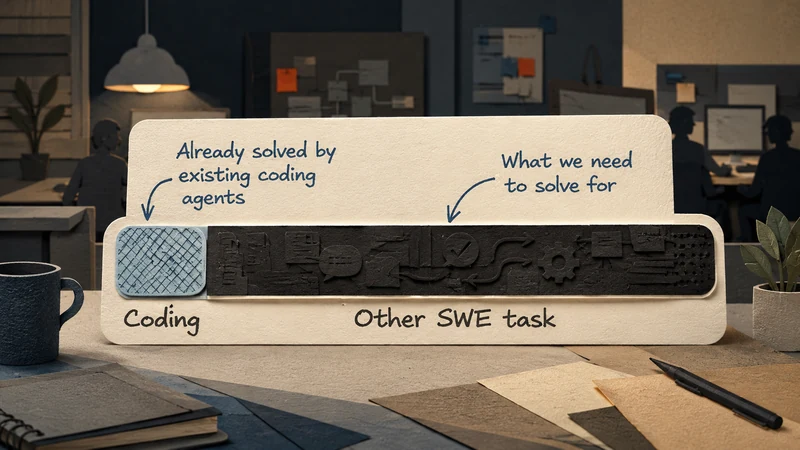
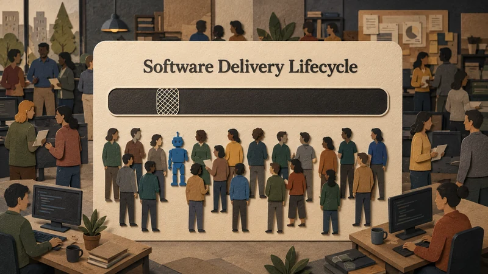
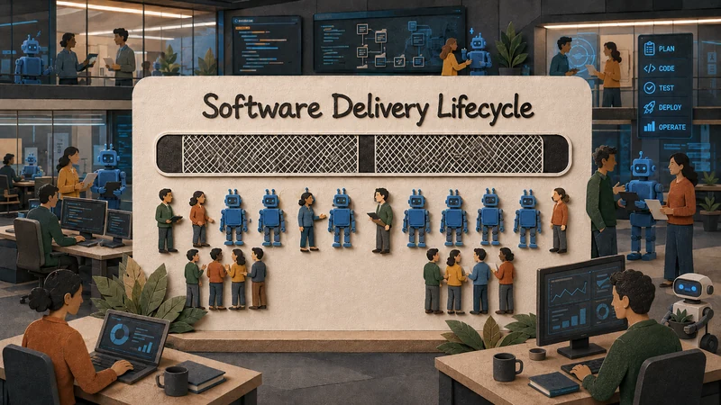

# The 90 Percent Problem of Agentic Software Delivery

*Coding agents look revolutionary in the demo. The real transformation begins when leaders stop measuring generated code and start redesigning the journey from intent to trusted release.*

Agent demos tend to stop at exactly the right moment. A vague instruction becomes a plan, the plan becomes code, the tests turn green, and someone says, “Ship it.” Nobody asks what the change will need to survive once it leaves the screen.

The ticket may still be half-written. An architecture exception may still need a decision from the person who remembers why the rule exists. The tests have not met production traffic, and the release process is waiting down the hall. A polished demo can make the most visible part of engineering look like the whole job.

Code matters, but it is not always the bottleneck. A [Microsoft Research study](https://www.microsoft.com/en-us/research/publication/today-was-a-good-day-the-daily-life-of-software-developers/) of 5,971 developer self-reports found that developers spend surprisingly little time on development. In a related discussion, Tom Zimmermann put code-writing at [66 minutes on a bad day and 96 on a good one](https://www.microsoft.com/en-us/research/podcast/the-productive-software-engineer-with-dr-tom-zimmermann/). The life-cycle view is broader: SEBoK's summary of SWEBoK treats construction as one phase among analysis, design, testing, operation, maintenance, and end-of-life work ([SEBoK](https://sebokwiki.org/wiki/Software_Engineering_in_the_Systems_Engineering_Life_Cycle)). The 10 percent figure is a provocation, not a law, but the direction is right. Making code appear faster does not transform delivery if everything around it continues to wait.

The tools are already moving beyond generation. GitHub describes [Copilot's cloud agent](https://docs.github.com/en/copilot/concepts/agents/cloud-agent/about-cloud-agent) in terms of repository understanding, branch changes, pull requests, and outcome metrics. OpenAI describes [Codex](https://openai.com/index/introducing-codex/) working inside configured environments with checks, terminal output, and human review. The frontier is not keystrokes. It is the route by which a change is understood, tested, reviewed, and trusted enough to release.

## The Old Queue

In the common model, the agent completes its assignment and the change starts waiting. A reviewer opens the diff and has to reconstruct the problem from the ticket because the agent solved the words it received, not necessarily the situation behind them. A green test run helps, but someone still has to judge whether the checks cover the behavior customers will touch and whether this week's release can absorb another risk.

This is how local acceleration creates downstream congestion. A pull request appears before the owner of a neighboring service has weighed in. CI fails for a reason nobody recognizes. A reviewer who is already behind receives work that looks finished but still has to be understood from scratch.

Management sees activity in branches, pull requests, and generated tests, while the delivery system feels heavier. The agent has removed work from the beginning of the process and moved ambiguity further downstream. The problem is not necessarily the agent; it is the operating model around it.

## The Delivery Control Plane

The better model begins earlier than the coding prompt and ends later than the pull request.

Before writing code, an agent should learn why the request exists, find the incident that explains an old workaround, notice relevant service boundaries, and distinguish the wording of the ticket from the business need.

As the work progresses, that context should become evidence a reviewer can inspect. A pull request should arrive with the intent, risks, tests, limits of those tests, and a reason the change is safe enough to consider. A green check alone is not an argument.

I call this layer the delivery control plane: the system that makes the reason for a change, its risks, and the evidence around it travel with the work.

Agents become more useful when they help an organization carry context forward instead of forcing people to reconstruct it at every handoff. The real unit of work is neither the prompt nor the diff. It is a change the organization is prepared to trust.

## Measure the Flow

Once the work is framed this way, the dashboard has to change.

A leader watching lines generated or agent-created pull requests is measuring one station in a longer process. Follow a single change from an ambiguous request until it is safely running in production. Note where it waits, what evidence has to be rediscovered, and which assumptions fail when they meet the real system.

The useful measure is how quickly the organization can turn an ambiguous request into a change it is willing to own, not how quickly code appears.

A useful measurement system should work more like a flight recorder than a scoreboard. It would show where a change came from, what it was meant to solve, which systems it touched, which checks ran, and why it was allowed to proceed. GitHub's agent metrics already point beyond raw code output toward pull-request outcomes such as PRs created, PRs merged, and time to merge ([GitHub Docs](https://docs.github.com/en/copilot/concepts/agents/cloud-agent/about-cloud-agent)). Those measures expose work hidden in the queue.

DORA's research has been warning in the same direction. The [2024 Accelerate State of DevOps report](https://dora.dev/report/2024) found that AI can improve individual productivity while introducing tradeoffs in delivery stability and throughput. The [2025 DORA report announcement](https://cloud.google.com/blog/products/ai-machine-learning/announcing-the-2025-dora-report) is blunter: AI amplifies what is already there. A companion guide on the [DORA AI Capabilities Model](https://cloud.google.com/blog/products/ai-machine-learning/from-adoption-to-impact-putting-the-dora-ai-capabilities-model-to-work) makes the operational point hard to dodge. Value stream mapping keeps local AI gains from piling work up downstream.

For leaders, the implication is uncomfortable: if the delivery system cannot carry context, AI will produce confusion faster.

## The ROI Trap

A coding-speed program can produce real gains and still disappoint. Microsoft's Copilot research deserves to be taken seriously: developers using AI assistance finished a contained implementation task [55.8 percent faster](https://www.microsoft.com/en-us/research/publication/the-impact-of-ai-on-developer-productivity-evidence-from-github-copilot/). The boundary around that result matters. A contained task is not an enterprise backlog.

In real organizations, the task begins as a customer complaint that may describe the symptom rather than the cause. It becomes a ticket written by someone who knows the business pain but not the system boundary. It moves into a codebase shaped by years of urgent compromises. It reaches a pull request whose reviewer has to infer not only what changed, but why this change is the right one. Then production gets its turn to ask for proof in its own dry language.

Spend the transformation budget on code generation alone and the spreadsheet may show productivity while the product still waits for trust. That is the ROI trap: the tool works, but the theory of change is incomplete.

The better ROI conversation starts with the backlog, not the license count. Pick one customer bug and follow it through the company. The obvious fix looks small until it crosses an old service boundary and nobody remembers why that boundary is there. By the time the pull request opens, the reviewer is not waiting for more code, but she is waiting for a reason to believe the change will not break production.

## What Leaders Should Do Instead

The practical move is to choose one narrow category of work and trace it end to end.

Choose a common path: a customer bug, a small feature, a dependency upgrade, a production incident follow-up. Map the journey from intent to release. Do not ask where the agent can write code. Ask where the organization loses context. Where does the reviewer have to infer the reason for the change? Where does release approval depend on memory rather than evidence?

Those are the places to aim the agent. Not at the glamorous center of the demo, but at the connective tissue of delivery: requirements clarification, codebase discovery, test selection, pull-request explanation, risk summaries, release notes, rollback plans, and post-release learning.

A useful pilot should be deliberately ordinary: a bug in a mature service or a dependency upgrade that crosses the boundary between product and infrastructure. Ask the agent to build the case before it builds the patch. Its first output should be a brief a reviewer can challenge: what behavior appears wrong, what previous decision may explain it, and what evidence would make a change safe to consider.

Then measure what the work still forces humans to reconstruct. If the reviewer has to summon the engineer who remembers the old migration, the agent has not reached the bottleneck. If QA accepts the tests only after a private explanation, the evidence is still trapped in a person. The pilot succeeds when the change leaves fewer mysteries behind.

The companies that benefit most will not treat agents as an unlimited supply of junior developers. They will redesign delivery so agents can participate in the full path from intent to evidence. Code generation will remain the easiest part to demonstrate, but the harder and more valuable work begins when the organization has to decide whether a change is ready to live in production.

That is the 90 percent problem.
