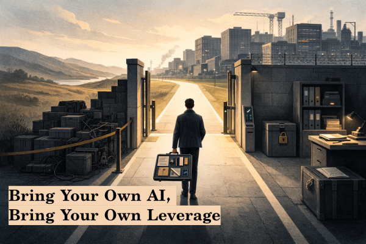

# Bring Your Own AI, Bring Your Own Leverage

The next divide in software is not between engineers who use AI and engineers who do not. That distinction is already dying. AI is becoming part of the plumbing. The real divide is between engineers who use it as a convenience and engineers who are quietly building a system around their own judgment.

Call that system BYOAI if you like. The name matters less than the reality. A certain kind of engineer is starting to assemble a portable augmentation layer that can survive tool churn, team changes, and even job changes. Not a private archive of company assets. Not a rogue bundle of internal docs and prompts. Something narrower and more durable: a way of turning messy intent into reliable work.

Companies can feel part of this shift already. You hear it in the new liturgy of governance. We need one approved tool. We need standardization. We need visibility. We need controls. That instinct is not irrational. A company wants an AI layer it can audit, constrain, and distribute without inviting chaos.

But the engineer has a different problem. Companies buy tools. Engineers are judged on output. The question for the individual is not just which tool the company picked. It is whether they are building a way of working that compounds over time.

That is the real promise of BYOAI. Not private magic. Not prompt hoarding. A portable system for thinking, specifying, reviewing, and shipping that gets better as you do.

In a hypothetical account of an “intelligence explosion,” the economic unit becomes **human plus AI** ([Nik G.][16]). You do not have to buy the timeline to see the direction. The engineer who can bring a disciplined augmentation layer into an institution will have leverage. The hard part is doing that without crossing the line between personal capability and company property.

## BYOAI is not a separate universe

The easiest mistake is to imagine personal AI and company AI as two sealed worlds.

That is not how work actually happens now, and it is probably not how it will happen later.

Right now, every new hire already arrives with a private operating history. They bring instincts, habits, patterns, review standards, decomposition tricks, scar tissue, and hard-won judgment from other companies and personal projects. They do not leave all of that at the door. They bring it in through the brain. The company’s engineering loop then changes a little in response. The hire adapts to the company, and the company adapts, at least a little, to the hire.

BYOAI should be understood in that same light.

A company has its own loop: its standards, specs, review process, architecture rules, security boundaries, and shipping culture. An engineer can have a personal loop too: reusable ways of turning requests into structure, structure into action, action into review. The future is not that one replaces the other. The future is that the relationship becomes more explicit.

At first, that interaction remains indirect. Your personal AI helps you think better, structure better, review better, and learn faster. Then you bring those improvements into the company the old-fashioned way, through your judgment, your decisions, your design comments, your code reviews, your specs. In time, with permission and with guardrails, some of that interaction may become more direct: personal AI systems and company AI systems informing each other across a controlled boundary.

That is the real thesis. BYOAI is valuable not because it lets you escape the company’s ecosystem, but because it helps you contribute more to it.

## The company loop and the personal loop should enhance each other

That is why it is too simple to say there is a personal core over here and a company overlay over there, with a hard wall and no contact except obedience. The better analogy is apprenticeship, but formalized.

A company’s AI layer will encode institutional memory: how specs are written, what standards matter, what review gates must hold, what risks are unacceptable, what “done” means in that environment. A personal AI layer can encode the engineer’s own best patterns: how they clarify vague requests, how they decompose ambiguity, how they test assumptions, how they pressure their own work before someone else has to.

Those two loops should meet.

Sometimes the company loop should dominate because the environment is highly regulated, highly sensitive, or simply has very good local practices. Sometimes the new hire’s personal loop should improve the company’s way of working because it carries a sharper spec habit, a better review discipline, a cleaner decomposition method, or a more robust way of checking outputs. That already happens informally through people. The point is that it may gradually happen more explicitly through AI systems too.

But that only works if the boundary is clear. Experience may cross. Protected artifacts may not.

That distinction matters because it keeps BYOAI from collapsing into either fantasy or theft. Fantasy says your personal AI can replace the company’s institutional layer. Theft says the company layer can be quietly copied into your private stack. Both are dead ends.

The real opportunity is narrower and more interesting. Build a personal loop that makes you better inside any company loop, then let the two improve each other within a controlled boundary.

## What you should actually build for yourself

If BYOAI is going to matter, it has to be more than a folder full of prompts.

The useful thing to build is a private, evolving loop for how you work. A system that helps you take fuzzy requests and push them toward something structured, testable, and shippable. Not because your personal loop is “the right one,” but because engineers who formalize their judgment get compounding returns.

One good example is spec-driven development. GitHub’s Spec Kit frames it as a way to make outcomes more predictable and avoid regenerating everything from scratch ([GitHub Spec Kit][6]). Thoughtworks treats spec-driven development as one of the engineering practices emerging with AI because specs are increasingly the natural interface between humans and models ([Thoughtworks][7]). Martin Fowler makes the same broader point in a looser way: the spec is becoming shared working material for both people and machines ([Martin Fowler][8]).

That matters here for a simple reason. A spec is one of the cleanest places for the personal loop and the company loop to meet.

The company may already have standards for what a good spec looks like. A strong engineer may arrive with their own disciplined way of turning a vague request into a tighter brief, then pressure-testing that brief before implementation begins. That does not undermine the company loop. It can strengthen it.

The same is true of decomposition, self-review, and verification. You do not need a giant personal framework. You need a few repeatable moves that actually help:

* turn a vague request into a clearer spec or plan
* break that work into tractable units
* review the output against explicit expectations
* pressure-test the result before it becomes someone else’s problem
* capture lessons that are general enough to reuse later

That is a personal loop. It is worth building because it makes you more useful now, and because it prepares you for a future in which personal AI and company AI may have a more direct handshake.

The engineer who waits for the company to build all of this for them is waiting too long.

## The firewall is what makes BYOAI legitimate

This is the part people will be tempted to wave away with vibes.

Do not.

BYOAI only works if there is a real firewall between transferable experience and non-transferable artifacts. That is what keeps the system ethical, defensible, and professionally credible.

Copyright law draws part of that line. It protects specific expression, not ideas or systems in the abstract ([Cornell LII][11]). Trade secret law draws another part. Information can be protected precisely because it is not generally known and because the company takes steps to keep it that way ([Cornell Wex][12]). Privacy law adds another warning. Sensitive or identifying information can remain risky even when obvious labels are stripped away ([OPC Canada][13]).

Then there is the employment reality. In the United States, software created within the scope of employment generally belongs to the employer ([ACC][17]). In Canada, ownership and control often turn on the employment relationship and the governing agreements ([Trade Commissioner Canada][14]; [Smart & Biggar][15]). In the EU, the practical default for employees is similarly employer-friendly, while contractors often require explicit assignment language ([Aptus Legal][18]).

That is the legal frame. The practical frame is even simpler.

Do not move internal code, internal prompts, internal specs, internal command files, internal system maps, internal heuristics, customer data, private schemas, or company-specific architecture knowledge into your personal stack. Do not rationalize this as “my workflow.” It is not your workflow if it is made of their assets.

What you can carry is the general lesson. The pattern. The clean-room version. The habit you can rebuild from first principles outside the company context.

That is how engineers have always developed. The difference is that AI makes the loop more explicit and therefore easier to misuse. Which means the responsibility becomes more explicit too.

## If you bring AI skills into the company, you own the risk too

This is where the security conversation comes back to the main thesis.

A future shaped by BYOAI will not only involve people bringing judgment into companies. It will also involve people bringing reusable skills, commands, hooks, and agent behaviors into company environments. That can be enormously valuable. It can also be reckless.

Claude Code’s skills system makes reusable routines a first-class concept ([Claude Code Docs][3]). Cursor documents both its own skills layer and compatibility with adjacent ecosystems ([Cursor Docs][1]; [Cursor Third-Party Hooks][2]). That is exactly why the security question matters. The more these systems become portable, the more human responsibility matters at the point where they touch the company’s environment.

Anthropic’s research on prompt injection makes the general risk clear: instruction-following systems can be manipulated through content, which turns context itself into an attack surface ([Anthropic][4]). Snyk’s ToxicSkills research and follow-up work on malicious skill distribution make the ecosystem risk even more concrete. A reusable skill can become a supply-chain problem the moment it inherits permissions and touches local resources ([Snyk][9]; [Snyk Follow-up][10]).

So BYOAI is not just “bring your own leverage.” It is also “bring your own responsibility.”

If you want your personal loop to interact with a company loop, you are responsible for how that interaction happens. You are responsible for permissions. You are responsible for what data enters the system. You are responsible for what code or behaviors you introduce. You are responsible for whether a useful skill is actually safe to bring into that environment.

That is not a side issue. It is part of the definition.

A mature BYOAI practice does not sneak capabilities into the company under cover of productivity. It treats portability as something that must be earned through transparency, review, permission, and restraint.

## Start building the loop now

The best advice is almost boring.

Start building your private loop now, on things you actually own.

Use personal projects, sandbox repos, or clean-room work to figure out how you like to specify, decompose, review, and verify. Build small reusable routines. See what survives contact with reality. Keep only the parts that generalize. Throw away the rest.

Then bring the value into work in whatever way is appropriate.

Sometimes that will be direct, with permission. You may be able to contribute reusable patterns, propose better spec practices, introduce safer review gates, or help shape the company’s own AI layer.

Sometimes it will still happen the old way, smuggled in through your brain. You will simply become the person who writes clearer specs, decomposes better, catches more edge cases, and improves the local loop by example.

Both paths matter. Both are valuable. Both prepare you for the more direct future.

Because that future is not hard to imagine now. Personal AI on one side. Company AI on the other. A controlled handshake between them. A negotiation between personal judgment and institutional memory. Not a merger. Not a free-for-all. A governed exchange.

The engineers who start building their side of that relationship now will be in a stronger position when the connection gets tighter.

That is why BYOAI matters.

Not because it lets you evade the company. Because it gives you something better to bring to it.

---

## References

* [Cursor — Skills Layer Documentation][1]
* [Cursor — Third-Party Hook Scripts][2]
* [Claude Code — Skills Documentation][3]
* [Anthropic — Prompt Injection Defenses (Research)][4]
* [GitHub — Spec Kit][6]
* [Thoughtworks — Spec-Driven Development: Unpacking 2025 Engineering Practices][7]
* [Martin Fowler — Exploring Gen AI: Spec-Driven Development Tools][8]
* [Snyk — ToxicSkills: Malicious AI Agent Skills in the Wild][9]
* [Snyk — ClawHub, OpenClaw, and Malicious Skill Distribution][10]
* [Cornell LII — 17 U.S.C. § 102: Subject Matter of Copyright][11]
* [Cornell LII — Trade Secret (Wex Legal Dictionary)][12]
* [Office of the Privacy Commissioner of Canada — Identifying Information Under PIPEDA][13]
* [Trade Commissioner Canada — Employment Contract IP Ownership for Canadian SMEs][14]
* [Smart & Biggar — Do You Actually Own the IP Generated by Your Canadian Employees?][15]
* [Nik G. — The 2028 Intelligence Explosion][16]
* [ACC — Quick Counsel: Software Work for Hire (United States)][17]
* [Aptus Legal — Who Owns the Code? IP Risks Under EU and Cyprus Copyright Law][18]

[1]: https://cursor.com/docs/context/skills
[2]: https://cursor.com/docs/agent/third-party-hooks
[3]: https://code.claude.com/docs/en/skills
[4]: https://www.anthropic.com/research/prompt-injection-defenses
[6]: https://github.com/github/spec-kit
[7]: https://www.thoughtworks.com/en-ca/insights/blog/agile-engineering-practices/spec-driven-development-unpacking-2025-new-engineering-practices
[8]: https://martinfowler.com/articles/exploring-gen-ai/sdd-3-tools.html
[9]: https://snyk.io/blog/toxicskills-malicious-ai-agent-skills-clawhub/
[10]: https://snyk.io/blog/clawhub-malicious-google-skill-openclaw-malware/
[11]: https://www.law.cornell.edu/uscode/text/17/102
[12]: https://www.law.cornell.edu/wex/trade_secret
[13]: https://www.priv.gc.ca/en/privacy-topics/privacy-laws-in-canada/the-personal-information-protection-and-electronic-documents-act-pipeda/pipeda-compliance-help/pipeda-interpretation-bulletins/interpretations_02/
[14]: https://www.tradecommissioner.gc.ca/en/market-industry-info/search-country-region/country/canada-united-states-export/intellectual-property-considerations-canadian-smes/employment-contract-ip-ownership.html
[15]: https://www.smartbiggar.ca/insights/publication/do-you-actually-own-the-ip-generated-by-your-canadian-employees-
[16]: https://nikgo.com/pages/articles/2028_intelligence_explosion.html
[17]: https://www.acc.com/resource-library/quick-counsel-software-work-hire-united-states
[18]: https://www.aptuslegal.com/insights/whoownsyourcode
