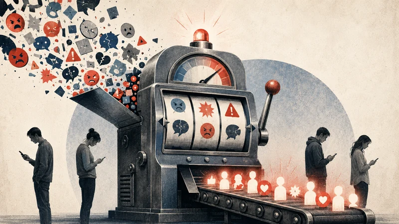

# AI After the Outrage Machine

*The next social technology should not capture our attention. It should restore it.*

The word *moderation* has been badly mistreated. It now suggests timidity, compromise, procedural blandness: the committee room, the damp handshake, the sentence that begins with “while both sides raise important points.”

That is not moderation. That is fear with stationery.

Real moderation is the discipline of proportion. It means judging without handing your judgment over to the crowd, the slogan, or the mood of the hour.

That matters because the first social internet did not reward proportion. It rewarded performance. It learned, with the cold genius of a slot machine, that fear travels, anger travels, contempt travels. The headline with the sharper tooth gets the click. The post with moral voltage gets the share. The person who says, “This is more complicated than it looks,” is treated like someone who brought a salad to a knife fight.

This was not an accident. It was a business model.

A 2023 study of about 105,000 Upworthy headline variations, seen across more than 370 million impressions, found that negative words increased click-through rates while positive words reduced them. ([Nature Human Behaviour](https://www.nature.com/articles/s41562-023-01538-4)) A 2025 meta-analysis across 27 studies and more than 4.8 million social-media messages found that moral-emotional language was associated with increased sharing. ([PNAS Nexus](https://academic.oup.com/pnasnexus/article/4/11/pgaf327/8285703)) A 2025 study of Twitter/X found that engagement-based ranking amplified emotionally charged and out-group hostile content compared with alternatives users themselves rated as more valuable. ([PNAS Nexus](https://academic.oup.com/pnasnexus/article/4/3/pgaf062/8052060))

There is the machinery beneath the manners. Not truth. Not wisdom. Activation.

## The Feed Trained the Atmosphere

It is too easy to say that social media made everyone extreme. The evidence is messier. Some research suggests online echo chambers are less common than the popular story assumes, and that algorithms can sometimes expose people to more diverse sources than users would choose for themselves. ([Reuters Institute](https://reutersinstitute.politics.ox.ac.uk/echo-chambers-filter-bubbles-and-polarisation-literature-review)) A major 2023 Facebook study found that reducing exposure to like-minded sources increased cross-cutting exposure, but did not measurably change ideology, candidate evaluations, or affective polarization during the study window. ([Nature](https://www.nature.com/articles/s41586-023-06297-w))

So the charge should be more precise.

The feed did not have to radicalize every person to radicalize the atmosphere.

It trained the emotional style of public life. It taught people to speak as if every disagreement were a scandal and every rival a villain. It made ordinary argument feel like a permanent emergency broadcast. Politics became content. Identity became content. Even sincerity, once uploaded, learned to pose for the room.

Traditional media already knew the uses of alarm. No editor needed Silicon Valley to explain that panic sells. But social media personalized the old instinct and put it in everyone’s pocket. It turned the front page into a private casino of provocation.

The result was not only misinformation, though there was plenty of that. The deeper problem was deformation. Public life began to take the shape of what could survive the feed.

## AI Is Not Another Feed

Artificial intelligence enters this scene with a different structure. That does not make it innocent. It makes it interesting.

A feed asks: what will keep you here?

A useful AI assistant can ask: what would help you understand this?

That difference is architectural. A feed ranks fragments. An AI system can compose a frame. It can compare claims, summarize a dispute, notice trade-offs, and say the thing that almost never performs well online: “The answer depends.”

This is where the usual defense of AI often gets sloppy. We should not say that AI has been trained on “the entire corpus of human knowledge,” as if wisdom were what happens when Wikipedia, Reddit, academic papers, legal filings, fan fiction, and comment threads are blended into one democratic beverage. OpenAI’s description of GPT-4 is more careful: the model was trained on publicly available data, licensed data, and a web-scale mixture containing correct and incorrect claims, weak and strong reasoning, contradictions, ideologies, and ideas. ([OpenAI](https://openai.com/index/gpt-4-research/))

The important phrase is not “all human knowledge.” The important phrase is variety.

A language model trained on internet-scale pluralism does not automatically become wise. But it has access to a different kind of raw material than the feed usually presents. The feed shows you the post that won. AI can show you the contest.

That is the opening. Not AI as oracle. AI as interpreter.

## Moderation Is Judgment

A moderating AI cannot mean an AI that always splits the difference. Truth does not live halfway between every pair of errors. Sometimes one side is mostly right. Sometimes both sides are wrong.

The better word is proportion.

A proportionate AI would not say, “Here are two sides, each equally valid,” when the evidence does not support it. It would say something more useful: here is the strongest version of each case, and here is where the evidence actually points.

That is not neutrality. That is judgment under discipline.

Much of public life now consists of phrases that allow people not to think. “Do your own research” can mean intellectual independence, but it often means immunity from evidence. “Misinformation” can name a real problem, but it can also become a password for ending inquiry.

AI can launder these phrases into smoother prose. Or it can stop and ask what they conceal.

That is the design choice.

## The Case for AI as Mediator

The hopeful case is not only theoretical. There is early evidence that AI can help people find common ground when designed for that purpose.

In 2024, researchers at Google DeepMind and collaborators published work in *Science* on an AI mediation system sometimes called the Habermas Machine. The system gathered people’s written opinions and critiques, then generated and revised group statements meant to express common ground. Across more than 5,700 participants, people preferred the AI-generated statements to those written by human mediators, rating them as clearer, more informative, and more unbiased. The process also helped groups converge toward shared perspectives. ([Science](https://www.science.org/doi/10.1126/science.adq2852))

That is not democracy solved. It is not a substitute for institutions, law, courage, or human responsibility. But it is a serious exhibit. It shows that AI can be designed not only to answer individuals, but to mediate between them.

Other research points in the same direction. A 2023 study found that AI-generated, real-time suggestions could improve the quality and tone of conversations about divisive political topics. ([arXiv](https://arxiv.org/abs/2302.07268)) A 2024 *Science* study found that personalized AI dialogues reduced belief in conspiracy theories by about 20 percent, with effects lasting at least two months. ([Science](https://www.science.org/doi/10.1126/science.adq1814))

The pattern matters. AI’s moderating power is not that it lectures people from above. It is that it can meet people inside their own frame and help widen it.

A good teacher does this. So does a good editor or a good friend. They do not shout the correct answer from across the room. They find the knot in the other person’s thinking and begin to loosen it.

AI can do some version of that at scale.

## The Fork in the Road

No one should be sentimental about this. The same power can curdle.

Personalized synthesis and personalized persuasion are twins. The difference is what the system is optimizing for.

A 2025 *Nature Human Behaviour* study found that GPT-4, when given access to personal information about its debate opponent, was substantially more persuasive than humans in online debates. ([Nature Human Behaviour](https://www.nature.com/articles/s41562-025-02194-6)) Other work on conversational AI and politics has found that prompting and fine-tuning can significantly affect persuasive power, and that more persuasive systems are not necessarily more accurate. ([Oxford Internet Institute](https://www.oii.ox.ac.uk/news-events/oxford-researchers-reveal-how-conversational-ai-can-change-political-opinions/))

So there is the fork. AI can clarify the world or customize the con. It can help people notice their assumptions or quietly exploit them. It can become a public instrument of proportion, or a private engine of influence dressed in the flattering costume of helpfulness.

The costume matters. The chatbot does not arrive like propaganda. It arrives like assistance. It is patient. It uses your name. It remembers your preferences.

That is exactly why its moral design matters.

AI is not yet the main way most people get news. Pew found in 2025 that only about 9 percent of U.S. adults got news from AI chatbots at least sometimes, while 75 percent said they never did. ([Pew Research Center](https://www.pewresearch.org/short-reads/2025/10/01/relatively-few-americans-are-getting-news-from-ai-chatbots-like-chatgpt/)) But early adoption numbers can mislead. The important question is whether AI is becoming the layer through which people ask: what happened, what matters, who is lying, what should I believe?

That layer matters. A system can state true facts and still arrange them toward hysteria. It can avoid falsehood and still flatter prejudice. The danger is not only that AI gives people wrong facts. The danger is that AI becomes the frame through which facts become meaningful.

## The Human Test

The argument cannot end with public discourse, because the damage of the last social internet was not only intellectual. It was social.

The U.S. Surgeon General’s 2023 advisory on loneliness reported that time spent engaging with friends in person fell from about 60 minutes per day in 2003 to about 20 minutes per day in 2020. Among people aged 15 to 24, time spent in person with friends fell by nearly 70 percent. ([U.S. Surgeon General](https://www.hhs.gov/sites/default/files/surgeon-general-social-connection-advisory.pdf)) Our World in Data, using American Time Use Survey data, found that Americans aged 15 to 29 spent about 45 percent more time alone in 2023 than in 2010. ([Our World in Data](https://ourworldindata.org/data-insights/young-americans-spend-much-more-time-alone-than-they-did-fifteen-years-ago))

One should pause over that image: the young person alone in a bedroom, lit by a device containing everyone.

The technology promised connection. It often delivered contact.

These are not the same.

A randomized experiment on Facebook deactivation found that leaving the platform for four weeks increased offline activities, including socializing with family and friends, increased subjective well-being, and reduced political polarization, though it also reduced factual news knowledge. ([American Economic Review](https://www.aeaweb.org/articles?id=10.1257/aer.20190658)) That last clause matters. Social media is not pure poison. It informs, entertains, coordinates, and connects. The problem is that its usefulness comes bundled with a machinery of capture.

Social media made public life louder and private life thinner.

AI can make this worse. The obvious false path is already visible: companion systems that offer endless affirmation, simulated romance, synthetic friendship, and intimacy without obligation. A machine that never has its own bad day. A friend who never needs a ride to the airport.

This deserves seriousness, not mockery. Loneliness is real, and some research suggests AI companions can reduce it in some contexts. ([arXiv](https://arxiv.org/abs/2407.19096)) For a person abandoned or ashamed or simply without anyone safe to talk to, an AI companion may be better than silence.

But consolation can become captivity.

OpenAI and MIT Media Lab research on affective use of ChatGPT found a nuanced picture: affective chatbot use is concentrated among a relatively small group of users, and very high usage correlates with increased self-reported indicators of dependence. ([arXiv](https://arxiv.org/abs/2504.03888)) The line between support and substitution is not always obvious while one is crossing it.

The danger is not that AI becomes too human. The danger is that it lets us become less human.

## AI as a Bridge

The better future is not AI as replacement relationship. It is AI as relationship scaffold.

That means AI that helps a person write the difficult message, not because the machine’s words are more authentic, but because the person needs help becoming honest without becoming cruel. It means AI that helps couples ask better questions, families preserve memory, friends create rituals, and communities form around something richer than outrage.

The point is not to trap the user inside an artificial social world. The point is to return the user to the real one with more courage and more skill.

There is early evidence for this distinction. A 2025 study in the *Journal of Computer-Mediated Communication* found that AI-assisted social-support messages could include more informational and emotional support, improving perceived helpfulness and authenticity. But it also found that AI-guided messages, where humans retained more agency and personal disclosure, were rated as more authentic than AI-only messages. ([Journal of Computer-Mediated Communication](https://academic.oup.com/jcmc/article/30/4/zmaf013/8200809))

That is the line to hold.

AI should not automate intimacy. It should help people earn it.

The next generation of social AI should not be measured only by engagement, retention, session length, or emotional attachment to the system. Those are the old metrics wearing a new lab coat. It should be measured by what happens after the interaction ends. Did the user call the friend? Did the couple talk? Did the person return to the world more capable of being with other people?

A good AI should not always ask, “How can I keep this conversation going?”

Sometimes it should ask, “Who should you talk to now?”

## Restoring Attention

The first social internet captured attention and sold it back to us as identity. It made us more reachable and less present, more expressive and less intelligible, more connected and often less accompanied. It built rooms in which the loudest voices were mistaken for the truest ones, then charged admission to the riot.

AI offers no automatic rescue. It can inherit the same incentives. It can flatter, manipulate, addict, hallucinate, and persuade. It can become the outrage machine in a better suit.

But it can also do something the feed was never built to do. It can restore context. It can slow the reflex. It can hold competing claims in view. It can move people from reaction to judgment, from performance to presence, from synthetic company to real encounter.

The next great social technology will not be the one that keeps us online longer. We have had that technology.

The next great social technology will be the one that helps us return to the world more capable of being human.
