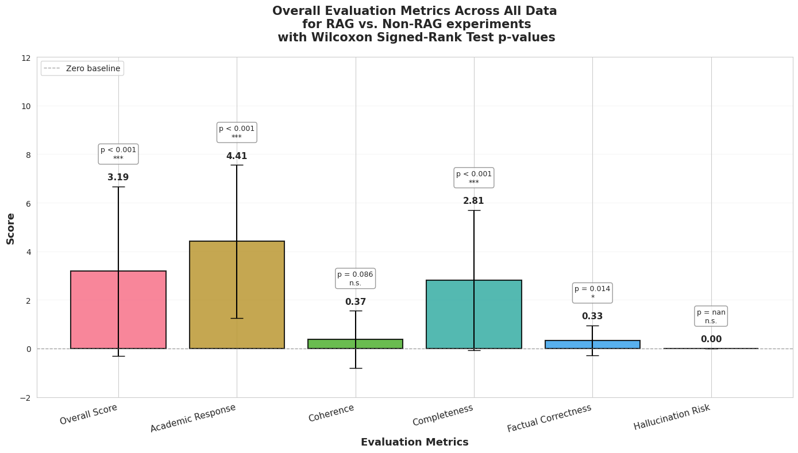
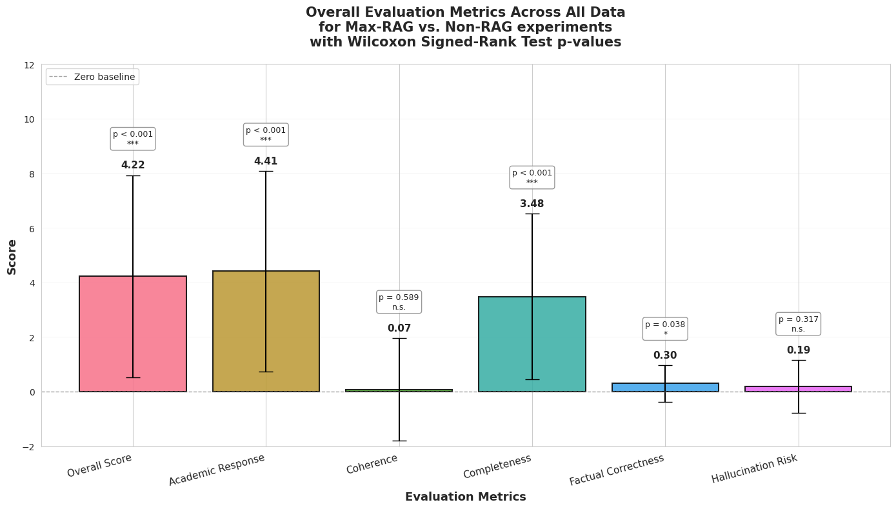
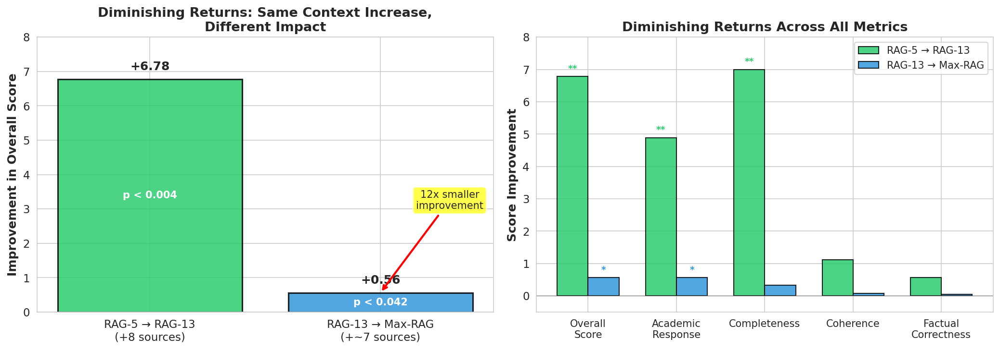

# The Dose-Response Curve of RAG: More Context Yields Diminishing Returns

**An Empirical Study on Retrieval-Augmented Generation for Knowledge-Intensive Tasks**

January 2026

Dominik Gorecki

---

## Abstract

Retrieval-Augmented Generation (RAG) has emerged as a powerful technique for grounding Large Language Model (LLM) responses in external knowledge. However, the relationship between retrieved context volume and response quality remains underexplored. This study investigates the dose-response characteristics of RAG using GPT-5.2 (extended thinking) across cognitive psychology questions, with response quality evaluated by Gemini 3 Pro Preview.

Our findings reveal three key insights:

1. **RAG provides significant benefits**: Balanced RAG (~13 sources, 8-10K tokens) improves overall response quality by +3.19 points (p<0.001) compared to no retrieval.

2. **Benefits are dose-dependent with diminishing returns**: Increasing from 5 to 13 sources yields a +6.78 improvement, while increasing from 13 to 20+ sources yields only +0.56—a 12x reduction in marginal gain for similar context increases.

3. **RAG improves coverage, not writing quality**: Academic response depth and completeness scale strongly with context volume, while coherence and readability remain statistically unchanged across all conditions.

Hallucination risk remained consistently low across all configurations, suggesting that for well-structured academic questions, RAG neither substantially increases nor decreases hallucination rates.

---

## 1. Introduction

Retrieval-Augmented Generation (RAG) has become a cornerstone technique in production LLM systems since its introduction by Lewis et al. (2020), who demonstrated that combining pre-trained parametric memory with non-parametric retrieval significantly improves performance on knowledge-intensive NLP tasks. By injecting relevant external documents into the prompt context, RAG promises to ground model responses in verifiable sources, reduce hallucinations, and enable access to information beyond the training cutoff.

Yet a fundamental question remains underexplored in practice: **How much context is optimal?** 

More than that, this question needs to be consistently asked as context windows expand with every new LLM model released.

Recent research has begun to reveal the complex relationship between context length and LLM performance. Liu et al. (2024) documented the "lost in the middle" phenomenon, showing that LLMs struggle to utilize information positioned in the middle of long contexts, with performance highest when relevant information appears at the beginning or end. The Chroma Research team's work on "context rot" demonstrates that performance degrades as tokens accumulate—like humans with limited working memory, LLMs have an "attention budget" that depletes with each added token. More striking still, recent work shows that even with *perfect retrieval*, performance degrades 13.9%–85% as input length increases, suggesting context length alone hurts performance independent of retrieval quality.

Practitioners face a tradeoff. More retrieved context may improve response quality and coverage, but it also:
- Increases token costs
- May introduce noise or contradictory information
- Risks diluting the most relevant sources through attention dispersion
- Can trigger the "lost in the middle" effect
- May exceed the model's effective working memory (estimated at 5-10 variables before degradation)

This study addresses these gaps by systematically varying RAG context volume and measuring its impact on response quality. We frame our investigation around the **dose-response** metaphor from pharmacology: just as medications have therapeutic windows where benefits plateau or reverse at high doses, we hypothesize that RAG exhibits similar characteristics.

### Related Work

The optimal configuration of RAG systems remains an active research area. Wang et al. (2025) provide a comprehensive study of RAG best practices, examining how factors like LLM size, prompt design, and chunk size influence response quality. Their work emphasizes the need to "strike a balance between contextual richness and retrieval-generation efficiency"—a tradeoff our study quantifies directly.

On chunk size, recent multi-dataset analyses show that optimal granularity is task-dependent: smaller chunks (64-128 tokens) work best for fact-based answers, while larger chunks (512-1024 tokens) improve retrieval for questions requiring broader context. This suggests that retrieval volume effects may interact with chunking strategy.

Regarding hallucination, studies show mixed results. The MEGA-RAG framework achieved 40%+ reduction in hallucination rates in public health applications, while RAGTruth corpus research demonstrates that well-designed RAG can significantly mitigate fabrication. However, other work cautions that the retriever itself can become a source of hallucination through retrieval granularity and embedding errors.

### Key Questions

1. Does RAG improve response quality compared to no retrieval?
2. Is the benefit dose-dependent (more sources = better)?
3. Where do diminishing returns set in?
4. Which quality dimensions benefit most from RAG?

Our findings suggest that RAG operates on a dose-response curve with steep diminishing returns. The "therapeutic window" for our domain appears to be approximately 10-15 high-quality sources—beyond which additional context yields marginal gains at increasing cost.

---

## 2. Methodology

### 2.1 Experimental Design

We conducted four experiments comparing different RAG configurations on cognitive psychology questions (e.g., optical illusions, top-down processing, perceptual mechanisms). Questions were designed to require substantial domain knowledge for comprehensive answers. These were all done in [VulcanLab OSS](https://vulclab.com) using it's method for RAG. The documentation in the provided link explains the RAG approach: query expansion, dense and lexical search with RRF plus an algorithm for grouping (VulcanLab: RAG Pipeline, 2025).

**Models Used**:
- **Answer Generation**: GPT-5.2 (extended thinking)
- **Response Evaluation**: Gemini 3 Pro Preview (independent judge model)

**Experimental Conditions** (presented in logical progression):

| Experiment | Comparison | Context Volume |
|------------|------------|----------------|
| A | No RAG vs Balanced RAG | 0 vs ~13 sources (~8-10K tokens) |
| B | No RAG vs Max RAG | 0 vs 20+ sources (20K+ tokens) |
| C | Limited RAG vs Balanced RAG | 5 vs 13 sources |
| D | Balanced RAG vs Max RAG | ~13 vs 20+ sources |

Each condition generated paired responses to identical prompts, enabling within-subject statistical comparisons.

### 2.2 Evaluation Metrics

Responses were evaluated on six dimensions using a comparative scoring system where positive scores indicate the RAG-enhanced response outperformed the baseline:

| Metric | Description |
|--------|-------------|
| **Overall Score** | Holistic quality assessment |
| **Academic Response** | Depth of scholarly/scientific content |
| **Coherence** | Logical flow and structural organization |
| **Completeness** | Breadth of topic coverage |
| **Factual Correctness** | Accuracy of claims |
| **Hallucination Risk** | Presence of unsupported or fabricated claims |

### 2.3 Readability Analysis

We additionally analyzed response readability using established metrics:
- Flesch Reading Ease
- Flesch-Kincaid Grade Level
- Gunning Fog Index
- SMOG Index
- Automated Readability Index (ARI)

### 2.4 Statistical Methods

All comparisons used the **Wilcoxon Signed-Rank Test**, a non-parametric paired test robust to non-normal distributions and appropriate for our sample sizes (n=9-27 paired comparisons per experiment). Effect sizes are reported as mean score differences.

Significance thresholds:
- \* p < 0.05
- \*\* p < 0.01
- \*\*\* p < 0.001

---

## 3. Results

### 3.1 RAG vs No-RAG: The Base Effect

Our first finding confirms that RAG provides substantial benefits over baseline generation.

**Balanced RAG (~13 sources) vs No RAG:**

| Metric | Improvement | p-value | Significance |
|--------|-------------|---------|--------------|
| Overall Score | +3.19 | <0.001 | *** |
| Academic Response | +4.41 | <0.001 | *** |
| Completeness | +2.81 | <0.001 | *** |
| Coherence | +0.37 | 0.086 | n.s. |
| Factual Correctness | +0.33 | 0.014 | * |
| Hallucination Risk | 0.00 | — | n.s. |

**Max RAG (20+ sources) vs No RAG:**

| Metric | Improvement | p-value | Significance |
|--------|-------------|---------|--------------|
| Overall Score | +4.22 | <0.001 | *** |
| Academic Response | +4.41 | <0.001 | *** |
| Completeness | +3.48 | <0.001 | *** |
| Coherence | +0.07 | 0.589 | n.s. |
| Factual Correctness | +0.30 | 0.038 | * |
| Hallucination Risk | +0.19 | 0.317 | n.s. |

**Key Finding**: RAG produces large, statistically significant improvements in overall quality (+3.19 to +4.22), academic depth (+4.41), and completeness (+2.81 to +3.48). However, coherence shows no meaningful improvement in either condition.

*Figure 1: Overall evaluation metrics comparing RAG-enhanced responses to baseline.*

*Figure 2: Overall evaluation metrics comparing maximally RAG-enhanced responses to baseline.*

---

### 3.2 The Dose-Response Curve: Diminishing Returns

The most striking finding emerges when comparing different RAG intensities.

**Limited RAG (5 sources) vs Balanced RAG (13 sources):**

| Metric | Improvement | p-value | Significance |
|--------|-------------|---------|--------------|
| Overall Score | +6.78 | <0.004 | ** |
| Academic Response | +4.89 | <0.008 | ** |
| Completeness | +7.00 | <0.004 | ** |
| Coherence | +1.11 | 0.125 | n.s. |
| Factual Correctness | +0.56 | 1.000 | n.s. |
| Hallucination Risk | +0.56 | 1.000 | n.s. |

**Balanced RAG (13 sources) vs Max RAG (20+ sources):**

| Metric | Improvement | p-value | Significance |
|--------|-------------|---------|--------------|
| Overall Score | +0.56 | <0.042 | * |
| Academic Response | +0.56 | <0.034 | * |
| Completeness | +0.33 | 0.095 | n.s. |
| Coherence | +0.07 | 0.527 | n.s. |
| Factual Correctness | +0.04 | 0.317 | n.s. |
| Hallucination Risk | 0.00 | — | n.s. |

**The Diminishing Returns Effect**:

- Going from 5 → 13 sources (+8 sources): **+6.78 overall improvement**
- Going from 13 → 20+ sources (+~7 sources): **+0.56 overall improvement**

This represents a **12x reduction in marginal benefit** for a similar increase in context volume.

*Figure 3 Diminishing returns in RAG effectiveness. Left panel shows overall score improvements at each transition. Right panel breaks down the effect across all evaluation metrics.*

---

### 3.3 Coverage vs Quality: A Dissociation

A consistent pattern emerges across all experiments: **RAG improves coverage metrics but not quality metrics**.

**Metrics that scale with RAG context:**
- Academic Response: Strong, significant improvements across all comparisons
- Completeness: Strong, significant improvements across all comparisons
- Overall Score: Driven primarily by coverage metrics

**Metrics that remain flat:**
- Coherence: No significant improvement in any comparison (p > 0.05 in all cases)
- Factual Correctness: Small or null effects
- Hallucination Risk: Consistently near-zero difference

This dissociation suggests that RAG fundamentally expands **what** the model discusses, not **how well** it discusses it. The model's ability to structure arguments, maintain logical flow, and write clearly appears to be an intrinsic capability unaffected by retrieved context.

---

### 3.4 Readability Analysis

Readability metrics support the coverage-vs-quality dissociation.

**RAG vs No-RAG (Balanced RAG ~13 sources):**

| Metric | RAG | No-RAG | Difference | p-value |
|--------|-----|--------|------------|---------|
| Answer Length (chars) | 8,808 | 4,210 | +4,598 | <0.001*** |
| Sentences | 69.2 | 39.7 | +29.4 | <0.001*** |
| Flesch Reading Ease | 18.0 | 34.6 | -16.6 | <0.001*** |
| Flesch-Kincaid Grade | 15.8 | 13.1 | +2.7 | <0.001*** |

RAG-enhanced responses are significantly longer and more complex (lower Flesch Reading Ease, higher grade levels), but this reflects increased technical depth rather than degraded writing quality.

**Balanced RAG vs Max RAG:**

| Metric | Max RAG | Balanced RAG | Difference | p-value |
|--------|---------|--------------|------------|---------|
| Answer Length (chars) | 9,787 | 8,808 | +979 | 0.002** |
| Sentences | 81.2 | 69.1 | +12.1 | <0.001*** |
| Flesch Reading Ease | 19.2 | 18.0 | +1.2 | 0.239 n.s. |
| Flesch-Kincaid Grade | 15.4 | 15.8 | -0.4 | 0.059 n.s. |

Between RAG configurations, length increases but readability remains statistically unchanged—further evidence that additional context adds volume without affecting prose quality.

---

### 3.5 Hallucination Risk

Across all four experiments, hallucination risk showed no significant differences between conditions:

| Comparison | Difference | p-value |
|------------|------------|---------|
| No RAG vs Balanced RAG | 0.00 | — |
| No RAG vs Max RAG | +0.19 | 0.317 |
| Limited vs Balanced RAG | +0.56 | 1.000 |
| Balanced vs Max RAG | 0.00 | — |

**Interpretation**: For this question type (well-structured academic questions in cognitive psychology), RAG neither increases nor decreases hallucination risk. The baseline model already performs reliably, and RAG's main contribution is coverage expansion rather than factual correction.

**Important caveat**: These questions were relatively straightforward. More specialized queries, edge cases, or adversarial prompts may show different hallucination patterns and require further investigation.

---

## 4. Discussion

### 4.1 Key Takeaways

1. **RAG works**: The technique provides clear, statistically significant improvements in response quality, validating its use in knowledge-intensive applications. This aligns with the foundational findings of Lewis et al. (2020) and subsequent surveys confirming RAG's effectiveness.

2. **Dose-dependent with steep diminishing returns**: The relationship between context volume and quality follows a logarithmic curve. Most benefit is captured with moderate retrieval; aggressive over-retrieval yields marginal gains. This pattern mirrors the "context rot" phenomenon documented by Chroma Research, where each additional token depletes the model's effective attention budget.

3. **Coverage ≠ Quality**: RAG expands what the model covers (topics, depth, sources), not how well it writes. Coherence and readability are intrinsic model capabilities unaffected by context volume. This finding has important implications: as Levy, Jacoby, and Goldberg (2024) showed in their study of input length effects, more tokens don't translate to better reasoning—they simply provide more material to reason *about*.

4. **Sweet spot around 10-15 sources**: For our domain, ~13 sources captured the majority of RAG's benefit. Going to 20+ sources yielded only 8% additional improvement at substantially higher cost. This aligns with practical recommendations to stay within 80% of effective context limits and with chunk-size research showing that retrieval quality matters more than quantity.

5. **Hallucination risk is stable**: At least for straightforward academic questions, RAG doesn't meaningfully change hallucination rates in either direction. This contrasts with some RAG hallucination studies showing 40-68% reductions, but our domain (well-structured academic questions) may represent a ceiling effect where the base model already performs reliably.

### 4.2 Practical Implications

**For RAG system designers:**

- **Don't over-retrieve**: The diminishing returns curve suggests that retrieval quality matters more than quantity. Focus engineering effort on improving relevance ranking rather than expanding retrieval volume.

- **Set retrieval budgets**: Our data suggests 10-15 high-quality sources as a reasonable default. Beyond this, additional tokens add cost without proportional benefit.

- **RAG won't fix bad writing**: If your application requires high coherence or specific writing styles, these must be addressed through prompting, fine-tuning, or model selection—not retrieval volume.

- **Monitor for your domain**: Our hallucination findings are domain-specific. Applications involving rare facts, numerical precision, or adversarial inputs require separate validation.

### 4.3 Limitations

1. **Single domain**: All experiments used cognitive psychology questions. Generalization to other domains (legal, medical, code, etc.) requires additional study.

2. **Question difficulty**: Our questions were relatively straightforward. RAG may show different patterns for edge-case queries or questions requiring synthesis across contradictory sources.

3. **Fixed retrieval strategy**: We varied only retrieval volume, not retrieval method. Different chunking strategies, embedding models, or reranking approaches may shift the dose-response curve.

4. **Single generation model**: Results may differ with other LLMs, particularly those with different context window sizes or training approaches.

---

## 5. Conclusion

This study establishes that Retrieval-Augmented Generation operates on a dose-response curve with clear diminishing returns. RAG provides substantial benefits over baseline generation, but these benefits plateau rapidly as context volume increases.

The practical sweet spot appears to be approximately **10-15 high-quality sources**. Beyond this threshold, practitioners face increasing costs with marginal gains—a pattern that should inform RAG system design and retrieval budgets.

Importantly, RAG's benefits are concentrated in **coverage** (academic depth, completeness) rather than **quality** (coherence, writing clarity). This dissociation has important implications: organizations seeking improved writing quality should look to model selection, prompting strategies, or fine-tuning rather than retrieval augmentation.

Future work should extend these findings across domains, question types, and retrieval strategies to establish more generalizable dose-response guidelines for RAG deployment.

---

## References

### Academic Literature

1. **Lewis, P., Perez, E., Piktus, A., Petroni, F., Karpukhin, V., Goyal, N., ... & Kiela, D. (2020).** Retrieval-Augmented Generation for Knowledge-Intensive NLP Tasks. *Advances in Neural Information Processing Systems (NeurIPS)*, 33. [[arXiv]](https://arxiv.org/abs/2005.11401) [[NeurIPS]](https://proceedings.neurips.cc/paper/2020/file/6b493230205f780e1bc26945df7481e5-Paper.pdf)

2. **Liu, N. F., Lin, K., Hewitt, J., Paranjape, A., Bevilacqua, M., Petroni, F., & Liang, P. (2024).** Lost in the Middle: How Language Models Use Long Contexts. *Transactions of the Association for Computational Linguistics*, 12, 157-173. [[ACL Anthology]](https://aclanthology.org/2024.tacl-1.9/) [[arXiv]](https://arxiv.org/abs/2307.03172)

3. **Levy, M., Jacoby, A., & Goldberg, Y. (2024).** Same Task, More Tokens: The Impact of Input Length on the Reasoning Performance of Large Language Models. *arXiv preprint*. [[arXiv]](https://arxiv.org/abs/2402.14848)

4. **Wang, X., et al. (2025).** Enhancing Retrieval-Augmented Generation: A Study of Best Practices. *arXiv preprint*. [[arXiv]](https://arxiv.org/abs/2501.07391)

5. **Gao, Y., et al. (2024).** Retrieval-Augmented Generation for Large Language Models: A Survey. *arXiv preprint*. [[arXiv]](https://arxiv.org/abs/2312.10997)

6. **Chroma Research. (2024).** Context Rot: How Increasing Input Tokens Impacts LLM Performance. [[Chroma Research]](https://research.trychroma.com/context-rot)

7. **Li, J., et al. (2025).** Context Length Alone Hurts LLM Performance Despite Perfect Retrieval. *arXiv preprint*. [[arXiv]](https://arxiv.org/abs/2510.05381)

8. **MEGA-RAG. (2024).** A Retrieval-Augmented Generation Framework with Multi-Evidence Guided Answer Refinement for Mitigating Hallucinations. *PMC*. [[PMC]](https://pmc.ncbi.nlm.nih.gov/articles/PMC12540348/)

9. **Wu, Y., et al. (2024).** RAGTruth: A Hallucination Corpus for Developing Trustworthy Retrieval-Augmented Language Models. *ACL 2024*. [[ACL Anthology]](https://aclanthology.org/2024.acl-long.585/)

10. **Jiang, Z., et al. (2024).** Retrieval Augmented Generation or Long-Context LLMs? A Comprehensive Study and Hybrid Approach. *EMNLP 2024*. [[ACL Anthology]](https://aclanthology.org/2024.emnlp-industry.66/) [[arXiv]](https://arxiv.org/abs/2407.16833)

11. **Chen, J., et al. (2025).** Rethinking Chunk Size for Long-Document Retrieval: A Multi-Dataset Analysis. *arXiv preprint*. [[arXiv]](https://arxiv.org/abs/2505.21700)

### VulcanLab Documentation

1. **Gorecki (2025).** RAG Pipeline: How VulcanLab Finds and Delivers Relevant Information. [[VulcLab]](https://vulclab.com/rag-pipeline/)

2. **Gorecki (2025)** RAG Settings Guide. [[VulcLab]](https://vulclab.com/rag-settings-guide/)
---

## Appendix: Statistical Summary Tables

### Table A1: Complete Results - RAG vs No-RAG Comparisons

| Metric | Balanced RAG vs No-RAG | Max RAG vs No-RAG |
|--------|------------------------|-------------------|
| Overall Score | +3.19 (p<0.001***) | +4.22 (p<0.001***) |
| Academic Response | +4.41 (p<0.001***) | +4.41 (p<0.001***) |
| Completeness | +2.81 (p<0.001***) | +3.48 (p<0.001***) |
| Coherence | +0.37 (p=0.086) | +0.07 (p=0.589) |
| Factual Correctness | +0.33 (p=0.014*) | +0.30 (p=0.038*) |
| Hallucination Risk | 0.00 | +0.19 (p=0.317) |

### Table A2: Complete Results - RAG Configuration Comparisons

| Metric | RAG-13 vs RAG-5 | Max-RAG vs RAG-13 |
|--------|-----------------|-------------------|
| Overall Score | +6.78 (p<0.004**) | +0.56 (p<0.042*) |
| Academic Response | +4.89 (p<0.008**) | +0.56 (p<0.034*) |
| Completeness | +7.00 (p<0.004**) | +0.33 (p=0.095) |
| Coherence | +1.11 (p=0.125) | +0.07 (p=0.527) |
| Factual Correctness | +0.56 (p=1.000) | +0.04 (p=0.317) |
| Hallucination Risk | +0.56 (p=1.000) | 0.00 |

---

*Generated from experimental data. For detailed methodology and raw outputs, see the linked Jupyter notebooks.*
