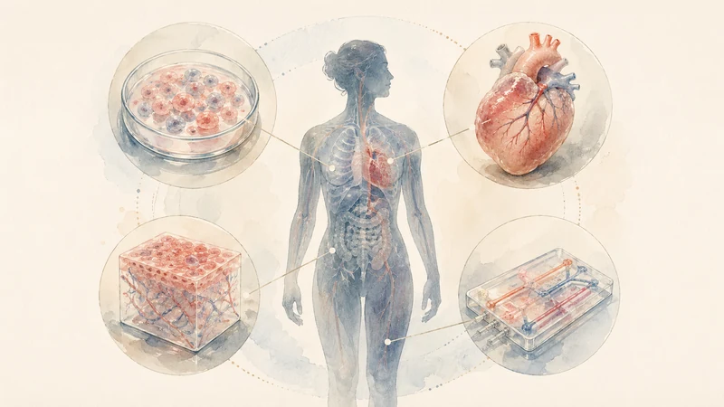

# Medicine’s Dead Time

A patient with newly diagnosed mantle cell lymphoma may not be waiting for a miracle. He may be waiting for the medical system to finish processing evidence it has already begun to understand.

Mantle cell lymphoma is a rare and typically aggressive form of non-Hodgkin lymphoma, accounting for roughly 6 percent of U.S. non-Hodgkin lymphoma cases, according to the Lymphoma Research Foundation ([Lymphoma Research Foundation][3]). With a diagnosis like that, the calendar is no longer administrative. Time means tumor burden, immune exhaustion, organ function, scan intervals, family logistics, and whether the next option arrives while the patient's body can still use it.

The patient need not be asking medicine to become careless or regulators to approve every well-funded molecule with a promising story. The simpler question is what exactly he is waiting for when a therapy is moving through the system, early signals are accumulating, and safety can be monitored closer to real time.

That question increasingly sounds scientific rather than merely impatient.

In April 2026, the U.S. Food and Drug Administration announced what, on paper, looked like a process reform: two proof-of-concept real-time clinical trials, one from AstraZeneca and one from Amgen. AstraZeneca’s TRAVERSE study is a Phase 2 multi-site trial in treatment-naïve mantle cell lymphoma, with participation from MD Anderson and the University of Pennsylvania. Amgen’s STREAM-SCLC trial is a Phase 1b study in limited-stage small cell lung carcinoma ([FDA][1]).

The agency described the move in the language of endpoints, safety signals, trial phases, and decision-making. Reuters sharpened the point: the program is meant to reduce “dead time” in drug development, with FDA Commissioner Marty Makary saying administrative tasks and paperwork consume about 45 percent of the time from early testing to submission for approval ([Reuters][2]).

“Dead time” is a revealing phrase. It names delay that comes not from toxicity, disease progression, or a failed endpoint, but from the machinery around the evidence. In lethal disease, it deserves to be taken literally.

## The Quiet Scandal of Latency

Modern medicine has reasonably organized much of its regulatory system around the patient harmed by an intervention released too soon. Bad drugs injure people, weak evidence misleads doctors, and false hope remains harmful even when it comes from a laboratory.

The moral ledger has another side. A patient harmed by a therapy becomes a visible adverse event. A patient who dies before a useful therapy arrives is more likely to disappear into background mortality.

This asymmetry shapes how medicine interprets risk. Action feels morally charged, while delay appears prudent and passive. For a patient with aggressive cancer, however, delay is not the absence of harm. It is a quieter form of it.

This is the central ethical reversal hiding inside the FDA’s real-time trial initiative. The agency deserves credit for making dead time visible. Once visible, it can no longer be treated as mere procedure. The days, weeks, and months consumed by data cleaning, package preparation, sequential review, duplicative queries, fragmented systems, and national silos are not just clerical residue. In lethal disease, they are part of the clinical environment.

The shorthand “first do no harm” does not command paralysis. Yet medical culture can turn the deeper ethic into a bias toward delay, as though danger lies primarily in acting while waiting occupies a clean moral space. It does not. Disease continues to act during the wait.

## What the FDA Just Admitted

The important part of the FDA's announcement is not its use of AI. It is the institutional admission that some delay represents latency rather than necessary caution.

In the real-time clinical trials model, regulators can see aggregated safety and efficacy signals as studies progress, rather than waiting for companies to compile traditional submissions after the fact. Reuters reported that the FDA would not receive raw patient data, but aggregated information such as adverse-effect rates and tumor responses ([Reuters][2]). That matters. It means the reform is not a fantasy of total surveillance or regulatory impulsiveness. It is an attempt to move the evidentiary process from batch mode toward live mode.

Conventional trials produce evidence, but the system often processes it in slow batches. Sites enroll patients, sponsors collect and clean data, reports are assembled, files are submitted, regulators review them, questions return, meetings follow, and decisions eventually emerge. Disease does not pause during this sequence.

Real-time trials do not abolish uncertainty. They do not make early signals definitive. They do not convert Phase 2 into omniscience. But they challenge an old assumption: that the pace of institutional review must lag far behind the pace of biological learning.

For a lymphoma patient outside the trial, the distinction is not merely procedural. If a therapy looks promising, safety signals are being watched, and regulators can see the evidence as it develops, why should the system behave as though knowledge exists only after it has been packaged?

## The Lesson AIDS Activists Forced Into Medicine

Medicine has heard this kind of question before.

During the AIDS crisis, patients and activists forced regulators, researchers, and physicians to confront a brutal fact: traditional evidentiary timelines can become morally grotesque when people are dying quickly and no adequate treatments exist. The FDA’s accelerated approval pathway was established to allow earlier approval of drugs for serious conditions with unmet medical need based on surrogate endpoints reasonably likely to predict clinical benefit ([FDA Accelerated Approval Program][4]). A 2022 analysis in *Therapeutic Innovation & Regulatory Science* notes that accelerated approval was established by FDA regulation in 1992 in response to the AIDS epidemic ([Therapeutic Innovation & Regulatory Science][5]).

That history is rightly remembered in part as a triumph of activism over bureaucracy. Its deeper lesson is that AIDS activists exposed an ethical accounting error: people dying outside the evidentiary process still belonged in the moral equation.

They were not arguing that every desperate patient should receive every experimental drug. They were arguing that perfecting evidence also carries a human cost.

That distinction matters now because the tools are changing. AIDS activists had urgency. Today, medicine may finally be building instruments that make urgency safer.

## From Slow Certainty to Continuous Learning

The future of drug development will not be shaped by one FDA pilot. It will be shaped by a larger scientific migration: from animal-heavy, sequential, paperwork-bound systems toward more human-relevant, computational, monitored, adaptive evidence systems.

The FDA's work on New Approach Methodologies points in this direction. The agency has described a shift toward human-relevant methods such as AI-powered models, organ-on-chip systems, and in silico modeling. It also notes that more than 90 percent of drugs that appear safe in animals fail in humans ([FDA New Approach Methodologies][6]). This does not make animal studies useless, but it does expose substantial uncertainty in the traditional pipeline.

AI will not solve this by itself. Models overfit, biological systems surprise us, and organoids are not people. An organ-on-chip cannot reproduce the full interaction among liver, immune system, microbiome, age, sex, comorbidity, environment, and chance.

Still, the direction of travel is clear. Better cellular models, organ-level systems, real-world data, adaptive designs, and real-time monitoring can make uncertainty more observable. They can reveal signals earlier. They can help identify toxicity sooner. They can make trial design more responsive. They can help regulators distinguish between necessary biological time and unnecessary administrative time.

The aim should not be speed for its own sake. It should be better safety. Traditional safety processes rely heavily on waiting, batching, reviewing, and approving. Newer systems can model, monitor, adapt, escalate, and withdraw when the evidence fails.

The answer to reckless acceleration is better instrumentation, not delay for its own sake.

## The National Border Is a Medical Artifact

Once evidence becomes more continuous, another problem comes into view: national drug-approval systems begin to look scientifically and morally outdated.

This is especially obvious in rare and lethal diseases. The patients are distributed across countries. The science is global. The sponsors are global. The investigators are global. The conferences are global. The datasets should be global. But the pathways remain stubbornly fragmented, split across national regulators, local reimbursement bodies, site-specific approvals, incompatible data systems, duplicated paperwork, and uneven access.

For a disease like mantle cell lymphoma, fragmentation is not a technical annoyance. It is slower learning. Slower learning means slower confidence. Slower confidence means slower access. And slower access means some patients deteriorate or die before the system finishes reconciling itself.

The World Health Organization has already moved partway toward this terrain. Its 2025 Global Action Plan for Clinical Trial Ecosystem Strengthening calls for sustainable, efficient, inclusive clinical-trial ecosystems that generate high-quality evidence for policy and practice ([WHO Global Action Plan][7]). The WHO also describes the plan as a way to help countries and stakeholders reform clinical trial systems so they are fit for purpose, inclusive, and locally led ([WHO Departmental Update][8]).

That last phrase matters. A global evidence system must not become a polished new instrument for rich countries to extract data from poor ones. It must not mean one imperial super-regulator. It must not mean lowering standards in the name of urgency. The point is not centralization for its own sake. The point is interoperable learning: shared endpoints, trusted data pipelines, real-time safety signals, harmonized evidence standards, faster recruitment, and regulatory cooperation that reflects the biological fact that cancer does not carry a passport.

The FDA pilot is admirable. But the moral horizon is larger than the FDA. If we can build more continuous evidence systems inside one country, the next question is whether we can build them across countries. If we cannot, then national borders become part of the disease environment.

## The Case Against Recklessness

There is an obvious objection to all of this, and it is a serious one. Faster can hurt people.

The recent history of drug approval is not a clean morality play in which bold patients and brilliant innovators are forever thwarted by timid bureaucrats. The world is messier. Desperate patients can be exploited. Early signals can fade. Surrogate endpoints can mislead. Companies can wrap commercial pressure in compassionate language. Regulators can approve therapies whose benefits remain uncertain, while the costs, clinical burdens, and risks arrive immediately.

Relyvrio for ALS is a useful warning. Amylyx began voluntarily discontinuing marketing authorizations in the U.S. and Canada after the Phase 3 PHOENIX trial failed to confirm benefit ([Amylyx][9]). Elevidys is an even sharper safety caution. In 2025, the FDA said it had received three reports of fatal acute liver failure following Sarepta AAVrh74 gene therapies, requested suspension of distribution for Elevidys, and placed related trials on hold ([FDA Elevidys Safety Action][10]).

These cases should not be waved away. They are the reason serious people distrust cheap accelerationism. Speed without reliable evidence is not compassion.

But these failures do not vindicate slow medicine as such. They vindicate disciplined learning. They argue for stronger monitoring, clearer uncertainty, better post-market obligations, faster reversals, and less tolerance for evidentiary fog. If a therapy is approved earlier, the system must be able to watch harder. If a signal collapses, the system must be able to withdraw faster. If risk emerges, the system must be able to act without theatrical surprise.

The defensible approach is to learn earlier, monitor continuously, act faster when the evidence supports action, and reverse course decisively when it does not.

That is a harder standard than the old one. It demands more of regulators, sponsors, clinicians, data systems, and patients. It also demands more honesty from the rest of us. We cannot continue to praise caution as though it were costless, then avert our eyes from the patient whose disease outruns the process.

## First, Count the Waiting

Return to the patient with mantle cell lymphoma. The trial is moving. The model is updating. Sites are enrolling. Tumor responses are being tracked. Safety signals are being watched. Somewhere, a regulator may be seeing the evidence sooner than the old system allowed.

And still, the patient waits.

The question is not whether he should be handed an unproven therapy because his suffering is real. Suffering alone does not make a drug work. The question is whether medicine’s inherited protocols still match its emerging capabilities. When evidence can be modeled more deeply, monitored more continuously, and shared more quickly, delay takes on a different moral weight.

The FDA's proof of concept points to an uncomfortable distinction. Some of what medicine calls caution is necessary science, and some of it is avoidable latency. The latter becomes harder to defend as monitoring and evidence systems improve.

Medicine’s deepest moral failure in the AI-biology era may not be moving too fast. It may be moving slowly out of habit, prestige, liability, paperwork, and institutional muscle memory, while insisting that the only harms worth counting are the ones caused by action.

Time in medicine is biological and therefore morally relevant. Any serious interpretation of “first do no harm” must count the harm of waiting alongside the harm of acting.

## References

* [FDA Announces Major Steps to Implement Real-Time Clinical Trials][1]
* [US FDA to monitor clinical trial data in real time in pilot program aimed at speeding approvals][2]
* [Mantle Cell Lymphoma][3]
* [FDA Accelerated Approval Program][4]
* [Analysis of FDA’s Accelerated Approval Program Performance][5]
* [FDA New Approach Methodologies][6]
* [WHO Global Action Plan for Clinical Trial Ecosystem Strengthening][7]
* [WHO releases global action plan to strengthen clinical trial ecosystems][8]
* [Amylyx announces formal intention to remove RELYVRIO/ALBRIOZA from the market][9]
* [FDA Requests Sarepta Therapeutics Suspend Distribution of ELEVIDYS][10]

[1]: https://www.fda.gov/news-events/press-announcements/fda-announces-major-steps-implement-real-time-clinical-trials
[2]: https://www.reuters.com/legal/litigation/us-fda-monitor-clinical-trial-data-real-time-pilot-program-aimed-speeding-2026-04-28/
[3]: https://lymphoma.org/understanding-lymphoma/aboutlymphoma/nhl/mantle-cell-lymphoma/
[4]: https://www.fda.gov/drugs/nda-and-bla-approvals/accelerated-approval-program
[5]: https://pmc.ncbi.nlm.nih.gov/articles/PMC9332089/
[6]: https://www.fda.gov/science-research/science-and-research-special-topics/new-approach-methodologies-nams
[7]: https://www.who.int/publications/i/item/B09338
[8]: https://www.who.int/news/item/08-05-2025-who-releases-global-action-plan-to-strengthen-clinical-trial-ecosystems
[9]: https://www.amylyx.com/news/amylyx-pharmaceuticals-announces-formal-intention-to-remove-relyvrior/albriozatm-from-the-market-provides-updates-on-access-to-therapy-pipeline-corporate-restructuring-and-strategy
[10]: https://www.fda.gov/news-events/press-announcements/fda-requests-sarepta-therapeutics-suspend-distribution-elevidys-and-places-clinical-trials-hold
