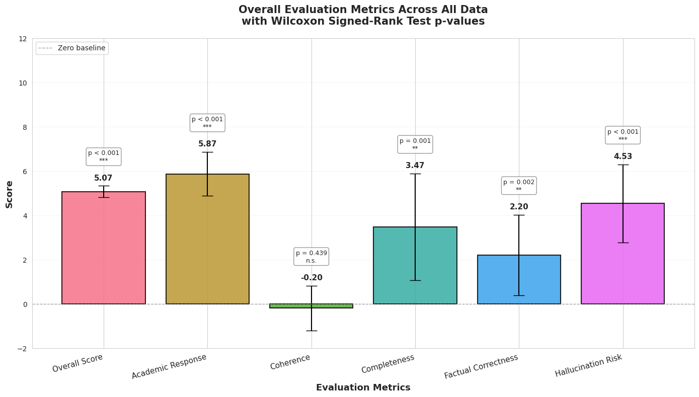
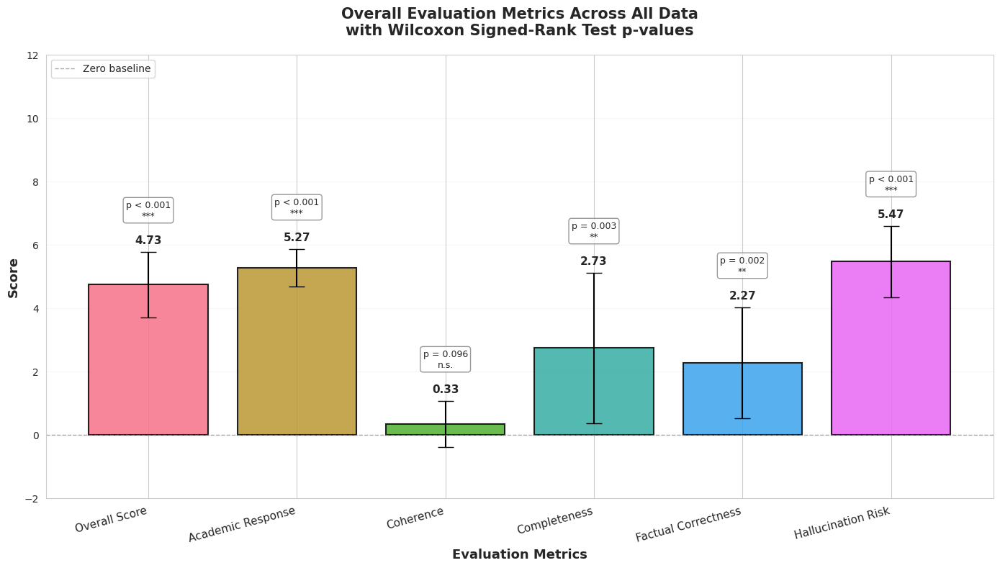
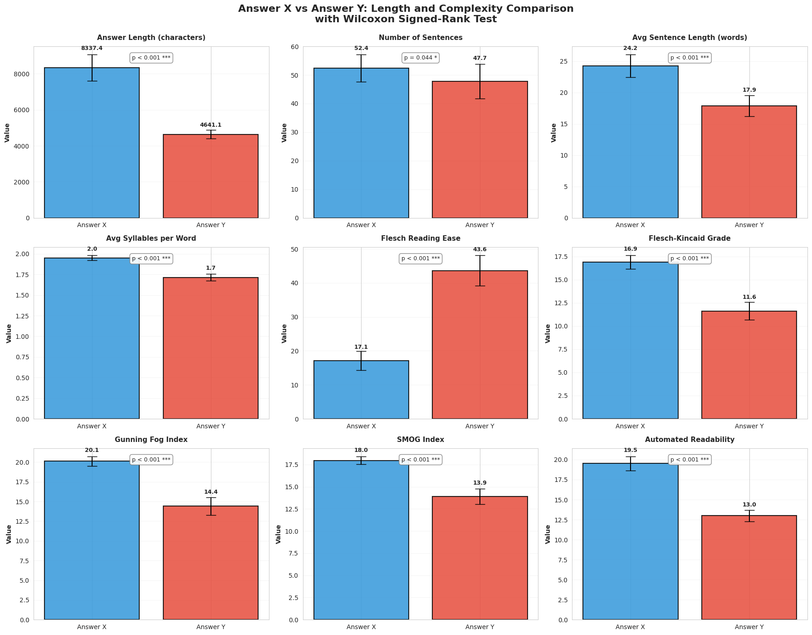
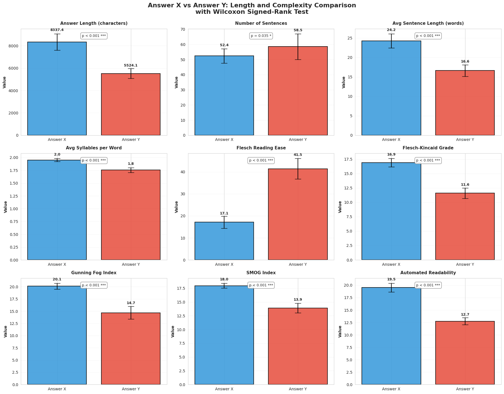

# Retrieval-Augmented Generation as a Capability Multiplier for Research Tasks

**Controlled evidence: same-model gains, and small-model-with-RAG beating large-model-without-RAG**

**Date:** January 26, 2026

**Author:** Dominik Gorecki

## Executive summary

Two controlled experiments tested whether Retrieval-Augmented Generation (RAG) improves research-grade outputs:

* **Experiment 1:** Gemini 3 Flash **with RAG** vs Gemini 3 Flash **without RAG**
* **Experiment 2:** Gemini 3 Flash **with RAG** vs Gemini 3 Pro **without RAG**

Across both experiments, using RAG produced **statistically significant improvements in 4 out of 5** evaluation dimensions (factual correctness, completeness, hallucination risk, and academic response). **Coherence** was the only dimension without statistically significant change.

These results align with recent research showing RAG improves factual reliability and mitigates hallucinations by grounding generation in retrieved evidence. ([arXiv][1]) They also align with findings that retrieval can fail to improve (or can even harm) aspects like response quality or integration unless carefully configured—suggesting coherence is a system-design problem, not an automatic win. ([ACL Anthology][2])

NLP analysis of outputs shows RAG responses are **significantly longer and more comprehensive**, but **harder to read** (more academic and denser). This is a trade-off that product teams should plan for via structured prompting and post-processing.

---

## Abstract

We evaluate Retrieval-Augmented Generation (RAG) as a system-level intervention for research-style synthesis tasks. In Experiment 1, we compare Gemini 3 Flash with RAG to Gemini 3 Flash without RAG. In Experiment 2, we compare Gemini 3 Flash with RAG against Gemini 3 Pro without RAG. Outputs are assessed via blinded pairwise evaluation by an LLM judge (ChatGPT 5.2 Thinking) across five dimensions: factual correctness, completeness, coherence, hallucination risk (lower risk scores higher), and academic response. Using Wilcoxon signed-rank tests on paired differences, we find statistically significant improvements from RAG in 4/5 dimensions in both experiments; coherence does not show statistically significant differences. Readability analyses indicate RAG outputs are significantly longer and more academically styled (worse readability scores). The results support the conclusion that RAG can act as a capability multiplier: improving research performance on the same model and enabling smaller models to outperform larger ones when retrieval is absent.

---

## 1. Background and related work

RAG is increasingly understood as more than “adding sources.” It is a strategy for **externalizing knowledge access** while letting the model focus on **synthesis, reasoning, and explanation**. This framing is consistent with a growing body of work showing that retrieval-grounding improves factual accuracy and reduces hallucinations across domains. ([arXiv][1])

At the same time, literature also highlights that retrieval is not uniformly beneficial: under some conditions, retrieval can fail to help or can introduce mismatch between retrieved context and what the model needs, degrading downstream quality. ([ACL Anthology][2]) Approaches like evidence refinement or better selection/condensation aim to reduce such mismatch and improve reliability—particularly when multiple documents are retrieved. ([ACL Anthology][3])

Finally, best-practice studies emphasize that RAG performance depends heavily on configuration choices (prompting, chunking, retrieval strategy, and relevance/precision trade-offs). ([ACL Anthology][4])

---

## 2. Experimental design

### 2.1 Research questions

All experiments used three research prompts:

1. **Selective attention and conscious awareness**

* 6 sources; 12,183 words (~20,076 tokens); Flash RAG input tokens: 16,648

2. **Reconstructive vs reproductive memory + consequences**

* 16 sources; 12,754 words (~20,874 tokens); Flash RAG input tokens: 18,781

3. **Sleep, consolidation, and forgetting**

* 16 sources; 9,914 words (~16,264 tokens); Flash RAG input tokens: 15,655

### 2.2 RAG corpus

* Domain: academic psychology + cognitive science papers
* Index: 250,296 vectorized chunks
* Chunk size: 300–500 words
* Retrieval policy: select references to target ~20K tokens of context when possible (using the heuristic 1 token ≈ ¾ word)

### 2.3 Generation conditions

**Experiment 1:** Flash+RAG vs Flash (no retrieval)
**Experiment 2:** Flash+RAG vs Pro (no retrieval)

Generation settings:

* Temperature = 1
* Top-P = 0.95
* No explicit output token limit

### 2.4 Evaluation protocol (blinded, pairwise, randomized ordering)

Judge: **ChatGPT 5.2 Thinking** (LLM-as-judge)

Each evaluation compares two answers using an integer signed scale (−10…+10) on:

* factual_correctness
* completeness
* coherence
* hallucination_risk (lower risk = higher score)
* academic_response

Ordering is randomized so the judge sees the two answers as A/B in random positions. Internally, Answer X is always the RAG output, but X may appear as A or B on any trial.

### 2.5 Statistics

* 15 paired evaluations per experiment (3 prompts × 5 trials)
* Wilcoxon signed-rank test against median difference = 0 (two-sided)

---

## 3. Results

### 3.1 Main finding: RAG improves 4/5 dimensions in both experiments

Across both experiments, RAG produces statistically significant improvements in:

* **academic_response**
* **completeness**
* **factual_correctness**
* **hallucination_risk**

**Coherence** does not show statistically significant change.

This pattern is consistent with prior work: RAG tends to improve factuality and reduce hallucinations by grounding the model in retrieved evidence, while higher-level discourse qualities (like coherence) often require additional system design (prompting, evidence selection, refinement). ([arXiv][1])

### 3.2 Experiment 1: Gemini 3 Flash (RAG) vs Gemini 3 Flash (no RAG)

Significant improvements were observed in 4/5 dimensions (excluding coherence).

**Figure 1:** *Overall dimension deltas (Flash+RAG vs Flash without RAG), with significance markers*

### 3.3 Experiment 2: Gemini 3 Flash (RAG) vs Gemini 3 Pro (no RAG)

Despite Pro offering substantially larger capacity, Flash+RAG still shows statistically significant improvements in 4/5 dimensions.

**Figure 2:** *Overall dimension deltas (Flash+RAG vs Pro without RAG), with significance markers*

### 3.4 Coherence: why it likely didn’t move

The coherence null result is not surprising if you treat RAG as “evidence injection.” Retrieval increases breadth and factual anchoring, but it can also:

* introduce competing framings across sources,
* increase detail density,
* tempt the model into “evidence dumping.”

Research explicitly documents that retrieval can help or hurt depending on conditions, and that mismatches between retrieved content and required knowledge can degrade output quality. ([ACL Anthology][2]) Best-practice work further emphasizes that prompt formulation and retrieval configuration remain crucial even inside RAG systems. ([ACL Anthology][4])

Practical implication: **RAG is not a coherence solution.** It’s a grounding/completeness solution. Coherence needs structure (templates, synthesis constraints, or a post-pass).

---

## 4. NLP analysis: longer, denser, more academic (and harder to read)

Your NLP analysis shows RAG outputs are:

* **significantly longer**
* **significantly more complex / academic in readability metrics**

This matches what you’d expect from retrieval-grounded synthesis: the system has more evidence available, so it produces more detailed, qualified answers. In applied domains, retrieval-grounded systems are often used explicitly to increase reliability and coverage (e.g., medical/public health and fact-checking settings). ([JMIR][5])

**Figure 3:** *Readability + length comparison panels (Flash+RAG vs Flash without RAG)*

**Figure 4:** *Readability + length comparison panels (Flash+RAG vs Pro without RAG)*

---

## 5. Implications for AI industry practice

### 5.1 Retrieval can substitute for scale in research workflows

Experiment 2 supports a blunt operational conclusion: for research-style tasks, **a smaller model with high-quality retrieval can outperform a larger model without retrieval** (on factuality, completeness, and hallucination-related measures).

This complements external evidence that RAG setups can offer performance advantages and favorable trade-offs between smaller and larger models depending on retrieval quality and evaluation criteria. ([MDPI][6])

### 5.2 Treat RAG as a system, not a feature toggle

Recent work emphasizes that RAG performance depends heavily on:

* prompt design,
* chunk size,
* retrieval strategy,
* quality/relevance of the knowledge base,
* evidence selection/refinement. ([ACL Anthology][4])

### 5.3 Recommended “research mode” pipeline

Given the coherence and readability trade-offs, the practical stack for research outputs is:

1. Retrieve (favor relevance + coverage)
2. Synthesize (claims → evidence → caveats)
3. Compress/Rewrite for audience (preserve meaning, improve clarity)
4. Optional: evidence consistency checks / refinement when using many sources ([ACL Anthology][3])

---

## 6. Limitations

1. Only three prompts (though each evaluated multiple times).
2. Domain concentrated in cognitive science/psychology.
3. LLM-as-judge evaluation: strong for consistency, but should be paired with human rating replication in future work.
4. Retrieval budget is a meaningful part of the intervention; results are about system behavior (model + retrieval), not model weights alone.
5. Coherence and readability are not guaranteed improvements under retrieval without additional design work. ([ACL Anthology][2])

---

## 7. Conclusion

Across two experiments, RAG yields statistically significant gains in **factual correctness, completeness, hallucination risk, and academic response**, both when holding the base model constant and when comparing a smaller RAG system against a larger non-RAG model. Coherence does not significantly change, reinforcing a key engineering lesson: **retrieval improves evidence and coverage; structure improves coherence.**

These findings match and extend recent literature showing that retrieval grounding improves factual reliability and reduces hallucinations, while system configuration and refinement determine whether those gains translate into consistently well-structured answers. ([arXiv][1])

---

# References (bibliographic)

* Jin, J., Zhu, Y., Zhou, Y., & Dou, Z. (2024). **BIDER: Bridging Knowledge Inconsistency for Efficient Retrieval-Augmented LLMs via Key Supporting Evidence**. *Findings of the Association for Computational Linguistics: ACL 2024*, 750–761. DOI: 10.18653/v1/2024.findings-acl.42. ([ACL Anthology][3])

* Kozhipuram, A. V., Shailendra, S., & Kadel, R. (2025). **Retrieval-Augmented Generation vs. Baseline LLMs: A Multi-Metric Evaluation for Knowledge-Intensive Content**. *Information, 16*(9), 766. DOI: 10.3390/info16090766. ([MDPI][6])

* Li, H., Huang, J., Ji, M., Yang, Y., & An, R. (2025). **Use of Retrieval-Augmented Large Language Model for COVID-19 Fact-Checking: Development and Usability Study**. *Journal of Medical Internet Research, 27*, e66098. ([JMIR][5])

* Li, J., Yuan, Y., & Zhang, Z. (2024). **Enhancing LLM Factual Accuracy with RAG to Counter Hallucinations: A Case Study on Domain-Specific Queries in Private Knowledge-Bases**. *arXiv:2403.10446*. ([arXiv][1])

* Li, S., Stenzel, L., Eickhoff, C., & Bahrainian, S. A. (2025). **Enhancing Retrieval-Augmented Generation: A Study of Best Practices**. *Proceedings of the 31st International Conference on Computational Linguistics (COLING 2025)*, 6705–6717. ([ACL Anthology][7])

* Maekawa, S., Iso, H., Gurajada, S., & Bhutani, N. (2024). **Retrieval Helps or Hurts? A Deeper Dive into the Efficacy of Retrieval Augmentation to Language Models**. *Proceedings of NAACL 2024 (Long Papers)*. DOI: 10.18653/v1/2024.naacl-long.308. ([ACL Anthology][2])

* Xu, S., Yan, Z., Dai, C., & Wu, F. (2025). **MEGA-RAG: A Retrieval-Augmented Generation Framework with Multi-Evidence Guided Answer Refinement for Mitigating Hallucinations of LLMs in Public Health**. *Frontiers in Public Health, 13*, 1635381. DOI: 10.3389/fpubh.2025.1635381. ([Frontiers][8])

[1]: https://arxiv.org/abs/2403.10446?utm_source=chatgpt.com "Enhancing LLM Factual Accuracy with RAG to Counter Hallucinations: A Case Study on Domain-Specific Queries in Private Knowledge-Bases"
[2]: https://aclanthology.org/2024.naacl-long.308/?utm_source=chatgpt.com "Retrieval Helps or Hurts? A Deeper Dive into the Efficacy of ..."
[3]: https://aclanthology.org/2024.findings-acl.42/?utm_source=chatgpt.com "BIDER: Bridging Knowledge Inconsistency for Efficient ..."
[4]: https://aclanthology.org/2025.coling-main.449.pdf?utm_source=chatgpt.com "Enhancing Retrieval-Augmented Generation: A Study of ..."
[5]: https://www.jmir.org/2025/1/e66098/?utm_source=chatgpt.com "Use of Retrieval-Augmented Large Language Model for ..."
[6]: https://www.mdpi.com/2078-2489/16/9/766?utm_source=chatgpt.com "Retrieval-Augmented Generation vs. Baseline LLMs"
[7]: https://aclanthology.org/2025.coling-main.449/?utm_source=chatgpt.com "Enhancing Retrieval-Augmented Generation: A Study of ..."
[8]: https://www.frontiersin.org/journals/public-health/articles/10.3389/fpubh.2025.1635381/full?utm_source=chatgpt.com "MEGA-RAG: a retrieval-augmented generation framework ..."
