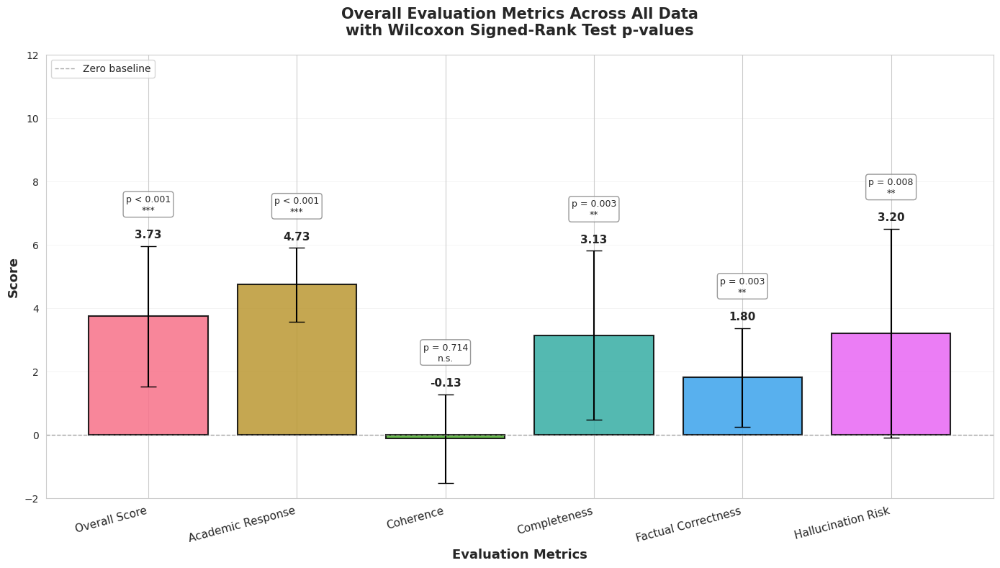
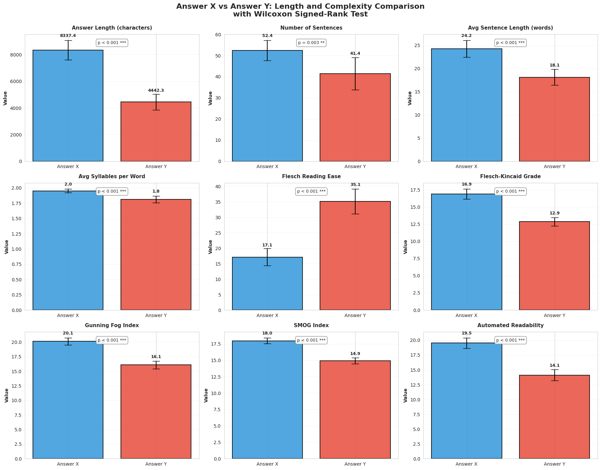

# Domain-Specific RAG with Gemini 3 Flash Beats PRO with Web Search Grounding

**Why a smaller model + an academic corpus can outperform a larger model grounded with search**

* **Date:** January 2026
* **Author:** Dominik Gorecki

## Executive summary

My previous white paper showed that **Gemini 3 Flash + domain RAG (academic psych/cog-sci corpus)** significantly outperforms (1) **Gemini 3 Flash without retrieval** and (2) **Gemini 3 Pro without retrieval** on 4/5 judged dimensions, with coherence the only non-significant metric. ([nikgo][1])

This new experiment tightens the baseline: **Flash + domain RAG** is compared against **Gemini 3 Pro + grounded with search** (a “web RAG” style system). The headline result holds: **domain RAG still wins, with statistically significant improvements** in **overall_score** and **4/5 dimensions** (factual correctness, completeness, hallucination risk, academic response), while **coherence remains not significant**—but the effect sizes and win rate are weaker than when Pro had no retrieval, which is exactly what you’d predict when you add grounding to the larger model.

---

## Abstract

Retrieval-Augmented Generation (RAG) is often treated as interchangeable with “grounding via web search,” but retrieval quality and corpus alignment should matter—especially for research-grade synthesis. We extend prior controlled experiments by comparing a **smaller model (Gemini 3 Flash) using a domain-specific academic RAG corpus** against a **larger model (Gemini 3 Pro) grounded with search**. Using blinded pairwise LLM-as-judge evaluation (ChatGPT 5.2 Thinking), randomized A/B ordering, and Wilcoxon signed-rank tests across five dimensions plus an overall score, we find statistically significant gains for domain RAG on **overall_score** and **4/5 dimensions** (excluding coherence). The win rate drops from the earlier “Pro without retrieval” baseline to **86.7% wins / 6.7% ties / 6.7% harms (n=15)**, indicating that search grounding narrows—but does not close—the gap. These findings support a stronger systems claim: **RAG is not one thing**; for research tasks, **domain-aligned corpora can beat general web grounding even on smaller models**.

---

## 1. What’s new compared to the previous white paper

The previous paper established two results:

1. **Same model, retrieval matters:** Flash + RAG > Flash without RAG. ([nikgo][1])
2. **RAG can substitute for scale:** Flash + RAG > Pro without RAG. ([nikgo][1])

This third experiment asks the harder question:

> If you give the larger model its own retrieval (search grounding), does the specialized academic corpus still win?

This is the important “real world” comparison, because many teams assume “Pro + web search” is effectively “best possible RAG.”

---

## 2. Background and related work

Recent work consistently finds that retrieval grounding can improve factual accuracy and reduce hallucinations, particularly for domain-specific or time-sensitive queries. ([arXiv][2])

But the literature is equally clear on a second point: retrieval is not automatically beneficial. Whether retrieval helps depends on **when you retrieve, what you retrieve, and how you integrate it**. ([aclanthology.org][3]) This is where “search grounding” and “domain RAG” can diverge:

* **Generic web retrieval** can be broad, noisy, and uneven in academic rigor.
* **Curated domain corpora** can concentrate high-signal evidence and support more disciplined synthesis.

Methods like evidence refinement (condensing retrieval into key supporting evidence) improve consistency and answer quality, underscoring that retrieval quality/integration are first-class system components—not add-ons. ([aclanthology.org][4])
And large best-practice benchmarks show RAG outcomes are sensitive to configuration choices (prompting, chunk size, KB size, retrieval strategies). ([aclanthology.org][5])

---

## 3. Experimental design

### 3.1 Tasks and corpus

* **3 research questions** (psychology/cognitive science), 5 trials each → **n=15** paired judgments.
* **Domain RAG corpus:** academic psych/cog-sci papers; **250,296** vectorized chunks (300–500 words).

### 3.2 Model conditions

* **Answer X:** Gemini 3 Flash + domain RAG (same RAG answers used in prior experiments)
* **Answer Y:** Gemini 3 Pro + grounded with search (web-grounded retrieval)

### 3.3 Evaluation protocol

* Judge: **ChatGPT 5.2 Thinking**
* Blinded pairwise A/B, randomized ordering
* Metrics:

  * overall_score
  * factual_correctness
  * completeness
  * coherence
  * hallucination_risk (lower risk = higher score)
  * academic_response
* Statistics: Wilcoxon signed-rank test (two-sided) on paired differences vs 0.

---

## 4. Results

### 4.1 Headline: domain RAG still wins vs Pro + search grounding

Across all 15 evaluations:

* **Win rate:** 86.7% (13/15)
* **Tie rate:** 6.7% (1/15)
* **Harm rate:** 6.7% (1/15)

This is weaker than the earlier comparison against **Pro without retrieval** (expected), but still strongly favorable overall.

### 4.2 Overall metrics and significance (Wilcoxon)

Mean paired differences (Answer X − Answer Y), n=15:

* **Overall score:** **+3.73**, p=**0.0008** (***)
* **Academic response:** **+4.73**, p=**0.0006** (***)
* **Completeness:** **+3.13**, p=**0.0035** (**)
* **Factual correctness:** **+1.80**, p=**0.0031** (**)
* **Hallucination risk:** **+3.20**, p=**0.0080** (**)
* **Coherence:** **−0.13**, p=**0.7139** (n.s.)

**Figure 1:** *Overall results bar chart — paired score deltas for overall_score + five dimensions, with significance markers*

**Interpretation:** compared to “Pro without retrieval,” grounding Pro with search improves the baseline, shrinking the gap—but **domain RAG still wins on the dimensions that matter most for research outputs**: factuality, completeness, academic quality, and hallucination risk.

### 4.3 Coherence again: still not significant

Coherence remains non-significant, matching the prior paper’s result. ([nikgo][1]) This aligns with broader findings that retrieval can help or hurt depending on conditions and that integration is a system-design problem (selection, reranking, synthesis constraints), not a guaranteed byproduct of “having sources.” ([aclanthology.org][3])

---

## 5. NLP analysis: domain RAG outputs are longer and more academic (and harder to read)

Compared to Pro + search grounding, domain RAG outputs are:

* **Much longer:** +3895 characters on average (p=0.0001)
* **Denser:** more sentences and longer sentences (both significant)
* **More complex:** lower Flesch Reading Ease and higher grade-level indices (all p=0.0001)

**Figure 2:** *Readability + length comparison panel (Answer X vs Answer Y)*

This trade-off is consistent with what you’d expect: when you retrieve from an academic corpus, the model tends to produce more qualified, terminology-rich synthesis. Similar effects appear in applied retrieval-grounded systems that prioritize evidence-driven reliability over readability. ([jmir.org][6])

---

## 6. Why domain RAG can beat “search grounding”

This experiment is basically a referendum on **corpus alignment**.

**Search grounding is retrieval**, but it’s retrieval from an open, heterogeneous corpus with:

* variable rigor,
* inconsistent terminology,
* and uneven incentives (SEO vs scholarship).

A domain academic corpus is:

* higher signal-to-noise for research questions,
* more conceptually coherent,
* and better aligned with what the judge rewards as “academic response.”

The research community’s “retrieval helps or hurts” results predict exactly this: if retrieval quality is noisy or mismatched, you don’t automatically get better synthesis—sometimes you just get more clutter. ([aclanthology.org][3])
And the best-practices / refinement line of work essentially says: you win when your retrieval system produces **the right evidence** and you integrate it **cleanly**. ([aclanthology.org][5])

---

## 7. Practical implications for AI teams

### 7.1 Don’t treat “RAG” as a checkbox

This study supports a stronger framing: **RAG is an architecture class**, and *corpus choice* is a primary driver of outcomes. ([aclanthology.org][5])

### 7.2 When Pro + search is “good enough”

If your task is:

* broad, current events,
* product comparisons,
* rapidly changing facts,
  then web grounding can close much of the gap.

### 7.3 When domain RAG wins (even on smaller models)

If your task is:

* research synthesis,
* academically constrained domains,
* high-cost hallucination settings,
  then a curated corpus can outperform generic search grounding. This matches evidence from domain-focused retrieval grounding work showing improved accuracy/reliability when grounded in a relevant curated literature base. ([arXiv][2])

### 7.4 Recommended “research mode” pipeline

* Retrieve from domain corpus (plus optional web for recency)
* Rerank + deduplicate
* Evidence refinement (KSE-style condensation)
* Synthesis with structure constraints
* Final “clarity pass” rewrite (to fix readability without losing substance)

This mirrors the direction of recent refinement/best-practices research. ([aclanthology.org][4])

---

## 8. Limitations

* Only three prompts (n=15 judgments); broader domains needed.
* LLM-as-judge is scalable but should eventually be triangulated with human evaluation.
* The Pro+search system’s retrieval behavior may vary with query formulation; “search grounding” isn’t a single fixed method.

---

## 9. Conclusion

Adding search grounding to Gemini 3 Pro improves the baseline and reduces the gap versus domain RAG—but **a smaller model with a domain-aligned academic corpus still wins**, with statistically significant improvements in **overall_score** and **4/5 judged dimensions**. The result generalizes the core thesis from the prior paper: *retrieval can substitute for scale*—and now adds a sharper point: **retrieval quality and corpus alignment can beat generic web grounding** for research tasks. ([nikgo][1])

---

# References

* Gorecki, D. (2026). *Retrieval-Augmented Generation as a Capability Multiplier for Research Tasks.* nikGo. ([nikgo][1])
* Jin, J., Zhu, Y., Zhou, Y., & Dou, Z. (2024). *BIDER: Bridging Knowledge Inconsistency for Efficient Retrieval-Augmented LLMs via Key Supporting Evidence.* Findings of ACL 2024. ([aclanthology.org][4])
* Kozhipuram, A. V., Shailendra, S., & Kadel, R. (2025). *Retrieval-Augmented Generation vs. Baseline LLMs: A Multi-Metric Evaluation for Knowledge-Intensive Content.* Information, 16(9), 766. ([MDPI][7])
* Li, J., Yuan, Y., & Zhang, Z. (2024). *Enhancing LLM Factual Accuracy with RAG to Counter Hallucinations: A Case Study on Domain-Specific Queries in Private Knowledge-Bases.* arXiv:2403.10446. ([arXiv][2])
* Li, S., Stenzel, L., Eickhoff, C., & Bahrainian, S. A. (2025). *Enhancing Retrieval-Augmented Generation: A Study of Best Practices.* COLING 2025. ([aclanthology.org][5])
* Maekawa, S., Iso, H., Gurajada, S., & Bhutani, N. (2024). *Retrieval Helps or Hurts? A Deeper Dive into the Efficacy of Retrieval Augmentation to Language Models.* NAACL 2024 (Long). ([aclanthology.org][3])
* Xu, S., Yan, Z., Dai, C., & Wu, F. (2025). *MEGA-RAG: A retrieval-augmented generation framework with multi-evidence guided answer refinement for mitigating hallucinations of LLMs in public health.* Frontiers in Public Health, 13. ([Frontiers][8])
* Li, H., Huang, J., Ji, M., Yang, Y., & An, R. (2025). *Use of Retrieval-Augmented Large Language Model for COVID-19 Fact-Checking: Development and Usability Study.* JMIR, 27, e66098. ([jmir.org][6])

---

[1]: https://nikgo.com/pages/articles/rag_as_a_capability_multiplier.html "Retrieval-Augmented Generation as a Capability Multiplier for Research Tasks | nikgo"
[2]: https://arxiv.org/abs/2403.10446?utm_source=chatgpt.com "Enhancing LLM Factual Accuracy with RAG to Counter Hallucinations: A Case Study on Domain-Specific Queries in Private Knowledge-Bases"
[3]: https://aclanthology.org/2024.naacl-long.308/?utm_source=chatgpt.com "Retrieval Helps or Hurts? A Deeper Dive into the Efficacy of ..."
[4]: https://aclanthology.org/2024.findings-acl.42/?utm_source=chatgpt.com "BIDER: Bridging Knowledge Inconsistency for Efficient ..."
[5]: https://aclanthology.org/2025.coling-main.449/?utm_source=chatgpt.com "Enhancing Retrieval-Augmented Generation: A Study of ..."
[6]: https://www.jmir.org/2025/1/e66098/?utm_source=chatgpt.com "Use of Retrieval-Augmented Large Language Model for ..."
[7]: https://www.mdpi.com/2078-2489/16/9/766?utm_source=chatgpt.com "Retrieval-Augmented Generation vs. Baseline LLMs"
[8]: https://www.frontiersin.org/journals/public-health/articles/10.3389/fpubh.2025.1635381/full?utm_source=chatgpt.com "MEGA-RAG: a retrieval-augmented generation framework ..."
