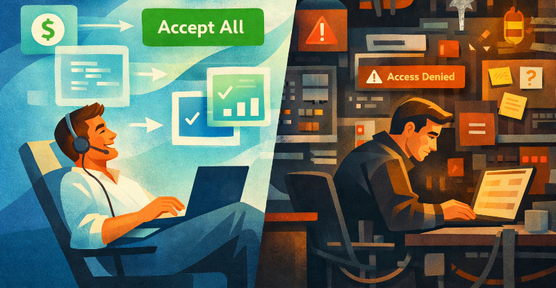
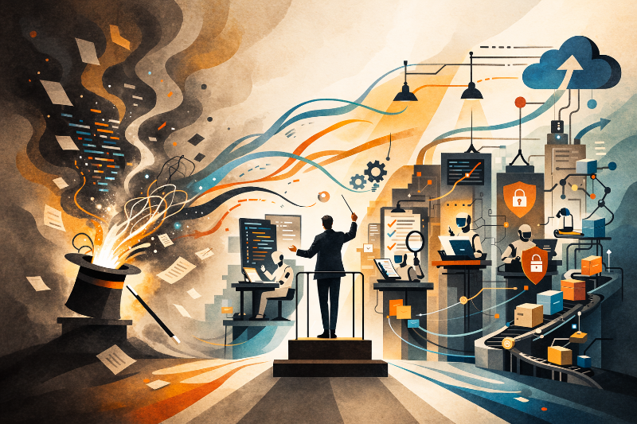

# The Vibe Trap

## The Phrase That Named a Mood

On February 2, 2025, Andrej Karpathy gave Silicon Valley a phrase so perfectly timed, so casually lethal, that it spread like a private joke that suddenly belonged to everyone. “Vibe coding,” he called it: tell the machine what you want, trust the machine to do the rest, and more or less forget that the code exists. He described talking to Cursor with SuperWhisper, barely touching the keyboard, asking for tiny changes because he was too lazy to find the right file himself. At one point he added the line that made every old-school engineer wince and every exhausted founder grin: “I ‘Accept All’ always.” It sounded reckless, liberating, and above all modern. ([Simon Willison’s Weblog][1])

And the thing is, it was not fake. Vibe coding was not a delusion. It was a real sensation, the first genuinely mass-market glimpse of software creation becoming conversational.

## Why Vibe Coding Felt So Revolutionary

Karpathy’s own MenuGen experiment made the case better than any venture deck could. Here was a self-described non-web-developer pushing an app from localhost to something real, with authentication, payments, deployment, and paying users. He called the experience “exhilarating” as a local demo. He also called it “a painful slog” once it became an actual deployed product. Those two judgments are not contradictory. Together they are the whole story. ([karpathy][2])

This is the split now opening up inside AI software creation, and it matters far beyond engineering teams. Vibe coding gives you rocket fuel for the first stretch of the journey. It turns software into wish fulfillment. A product manager can sketch. A founder can ship. A smart amateur can suddenly brute-force past old gatekeepers. For prototypes, demos, side projects, and exploratory bets, that is extraordinary. It should not be dismissed. The problem is what happens when the prototype starts hiring people, collecting revenue, touching customer data, or simply surviving long enough to become important. Then the hidden bill arrives. ([Simon Willison’s Weblog][1])

## When the Prototype Becomes a Haunted House

Anyone who has built with these systems for more than a weekend knows the feeling. At first the machine feels clairvoyant. Then the project grows. Context stretches. Patterns drift. Fixes create fresh breakage three files away. Small oddities become architecture. Silent failures creep in. Security assumptions go unexamined. A thing that felt fluid starts to feel haunted.

Karpathy’s own account of MenuGen reads like a diary of this transition: outdated knowledge, subtle design mistakes, hallucinated deprecated APIs, and a constant shuffle among settings, keys, dashboards, and services that the model could not really see or manage. It is not that the AI cannot code. It is that production software is not just code. It is systems, constraints, interfaces, state, and consequences. ([karpathy][2])

## The Debt Problem Gets Worse, Not Better

That distinction matters because technical debt was already enormous before the AI boom turned code generation into an industrial fire hose. In the United States alone, poor software quality costs at least $2.41 trillion a year, with accumulated technical debt estimated around $1.52 trillion. Accenture, citing that research, notes that 41 percent of executives identify AI as the highest contributor to tech debt, tied with enterprise applications. In other words, the world did not need a faster way to create fragile systems. It got one anyway. The recent backlash has been blunt for a reason. Forbes Technology Council articles in February 2026 warned that vibe coding does not guarantee scalability or stability and, in enterprise settings, can leave behind a trail of AI-generated debt and governance problems. ([Accenture][3])

## From Vibe Coding to Agentic Engineering

Then came the reversal, or rather the maturation. One year after coining vibe coding, Karpathy publicly marked the next phase. On February 4, 2026, he looked back and said the original mode had been good for “fun throwaway projects, demos and explorations.” Now, he wrote, “programming via LLM agents is increasingly becoming a default workflow for professionals,” but with “more oversight and scrutiny.” His preferred term was “agentic engineering.” That phrase sounds drier, less memeable, less likely to make a T-shirt. It is also much more important. The center of gravity had shifted from prompting for outcomes to directing a process. ([TeamDay.ai][4])

## Delegation, Not Magic

Agentic software engineering is what happens when you stop treating the model like a magician and start treating it like a highly capable junior workforce that requires architecture, review, testing, and taste. The “how” comes back into the picture. You define patterns before features. You give the agent boundaries, interfaces, and constraints. You let one agent implement, another test, another review, and you reserve human attention for the judgments that actually matter.

Karpathy now says programming is becoming “unrecognizable,” but in the same breath insists that deep technical expertise is still a multiplier and that this is “not magic, it’s delegation.” Anthropic’s 2026 agentic coding report says much the same in more institutional language: the engineer’s role is shifting from implementer to orchestrator, with human supervision, validation, and judgment staying central, especially for high-stakes work. ([Business Insider][5])

## Why This Is Not Just Old Discipline Rebranded

This is why the common objection, that “agentic engineering” is just old-school software discipline with extra steps, misses the point. Yes, it revives discipline. Good. That is the upgrade. But it also changes the slope of the work. In fragile projects, complexity compounds against you. Every new feature makes the next one harder. In agentic projects, once patterns are established and grounded, the reverse can happen. The bigger system becomes more legible to the agent stack and more leverageable to the human conductor.

Anthropic argues that organizations mastering oversight and coordination can ship in hours instead of days, while engineers apply judgment across a broader scope than line-by-line implementation ever allowed. This is not nostalgia. It is a new operating model.

## Why the C-Suite Should Pay Attention

Executives and investors should care because this is rapidly becoming an organizational question, not a tooling preference. Gartner says 40 percent of enterprise applications will include task-specific AI agents by the end of 2026, up from less than 5 percent in 2025, and has warned separately that more than 40 percent of agentic AI projects may still be scrapped by 2027 because of cost, hype, and weak business value. Both claims can be true at once. The market is moving fast, and a lot of people will still do it badly.

Deloitte likewise expects software companies in 2026 to “agentify” more operations, especially in areas where governance, identity, risk, and compliance suddenly matter much more. The winners will not be the firms that sprayed AI across their stack first. They will be the ones that learned to impose structure before the mess hardened into tomorrow’s legacy estate. ([gartner.com][6])

## The Executive Role That Does Not Quite Exist Yet

Which brings us to the executive role that does not quite exist yet, though you can already see its silhouette. Call it the Chief Agentic Executive. Not a super-engineer, not a prompt whisperer, but a conductor of systems. This person understands how agents should be orchestrated across product, software, operations, finance, and marketing; where human judgment must stay in the loop; where quality gates belong; which tasks should be automated; and which should never be.

Anthropic expects agentic workflows to extend beyond engineering into less technical roles across organizations. Gartner says C-level leaders have only a short window to define strategy and investments before the field moves around them. The job description is being rewritten in real time.

## Keep the Joy, Lose the Illusion

There will still be room for vibe coding, of course. There should be. Weekend hacks, scrappy MVPs, quick experiments, little acts of productive mischief, these are not defects of the new age. They are part of its joy. But if the past year proved anything, it is that speed alone is not a strategy.

One year after popularizing vibe coding, Karpathy himself chose a different label for serious work. That should tell us something. The future does not belong to the people who can most fluently tell a machine what they want and pray. It belongs to the people who can make a growing system easier, safer, and stronger as it scales. In software, as in music, the amateurs fall in love with the rush. The professionals learn to conduct. ([TeamDay.ai][4])

[1]: https://simonwillison.net/2025/Mar/19/vibe-coding/ "Not all AI-assisted programming is vibe coding (but vibe coding rocks)"
[2]: https://karpathy.bearblog.dev/vibe-coding-menugen/ "Vibe coding MenuGen | karpathy"
[3]: https://www.accenture.com/ca-en/insights/consulting/build-tech-balance-debt "Managing Technical Debt with a Digital Core | Accenture"
[4]: https://www.teamday.ai/blog/vibe-coding-to-agentic-engineering "From Vibe Coding to Agentic Engineering: One Ye - TeamDay.ai"
[5]: https://www.businessinsider.com/andrej-karpathy-programming-unrecognizable-ai-2026-2 "Guy Who Coined 'Vibe Coding' Says Programming Is 'Unrecognizable' - Business Insider"
[6]: https://www.gartner.com/en/newsroom/press-releases/2025-08-26-gartner-predicts-40-percent-of-enterprise-apps-will-feature-task-specific-ai-agents-by-2026-up-from-less-than-5-percent-in-2025 "Gartner Predicts 40% of Enterprise Apps Will Feature Task-Specific AI Agents by 2026, Up from Less Than 5% in 2025"
