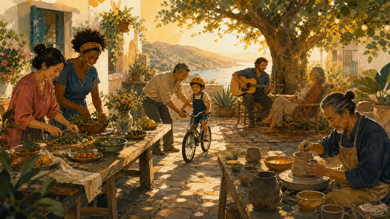
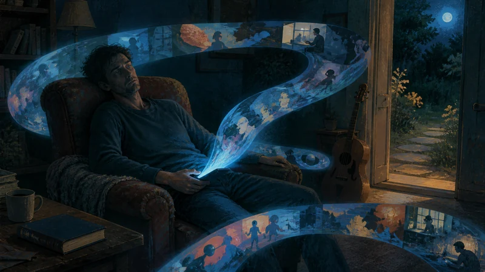
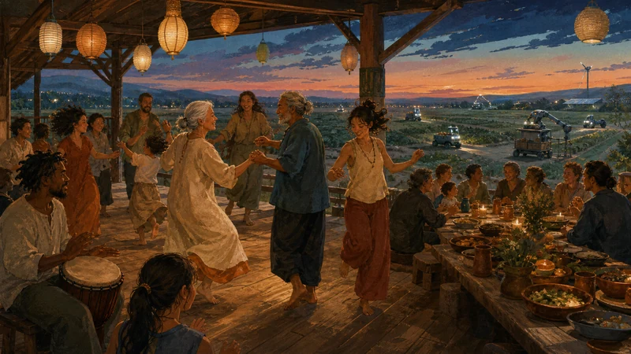

# What Freedom Is For

*AI may give us more free time than any civilization has known. The harder problem will be learning how to live in it.*

Picture an ordinary citizen of an abundant future. His AI has cleared the email, reviewed the contract, compared the mortgages, ordered the groceries, booked the dentist, and sent a robot to deal with the leaking faucet. It has even drafted three tasteful birthday messages for relatives he would otherwise remember several days too late.

By dinner, the work is done. An entire evening has been returned to him.

At 11:47 p.m., he is still awake, face lit by a six-inch rectangle, watching a stranger explain why another stranger’s refrigerator organization system reveals a narcissistic personality disorder.

This is one of the harder problems hiding inside the promise of AI. The technology may eventually give us more free time than any society has known, but free time is not a finished human good like clean water or penicillin. It is an empty container. It can hold friendship, craft, beauty, play, learning, contemplation, love, and rest. It can also hold four hours of content that leaves no memory beyond a vague concern that somebody, somewhere, is using an air fryer incorrectly.

**AI can make leisure abundant. It cannot make leisure good.**

## The problem Keynes saw coming

John Maynard Keynes saw the outline of this problem in 1930, as the world was sliding into the Great Depression. In *Economic Possibilities for Our Grandchildren*, he predicted that technological progress might eventually reduce necessary labour to three hours a day, or fifteen hours a week. By around 2030, he thought, wealthy societies could largely solve the old struggle for subsistence.

The forecast is now remembered for the part that failed. Wealth rose; the fifteen-hour workweek did not arrive. Yet Keynes’s more interesting point concerned psychology, not scheduling. Once necessity retreated, humanity would face its “permanent problem”: learning how to use freedom to live wisely and well. ([John Maynard Keynes][1])

Aristotle had posed a version of the same problem much earlier. Education, he argued, should prepare people not only to work well but to **use leisure well**. Work made the rest of life possible; it was not the purpose of life itself. Leisure, on this account, was more than a recovery bay where workers were repaired before Monday. It was one of the places where human flourishing happened. ([Aristotle][2])

For most of history, this was a practical concern mainly for aristocrats, monks, scholars, and the occasionally fortunate goat herder. Most people had crops, children, animals, factories, ledgers, laundry, and the recurring nuisance of not starving. AI could bring the question to everyone else.

Economic models of a transition to artificial general intelligence consider what happens when machines can perform essentially all economically useful tasks rather than a limited set of jobs. In those models, production is no longer constrained by the supply of human labour. If intelligence and, eventually, physical action can be reproduced through software and machinery, immense output stops requiring immense human effort. ([Anton Korinek and Donghyun Suh][3])

No model can tell us when such a world will arrive, and one need not believe that next Tuesday’s chatbot will become the god-emperor of accounting. The long-run logic is enough. If AI and robotics eventually handle most of the cognitive and physical work needed to sustain material civilization, abundant discretionary time will be one of the consequences.

Grant the premise for a moment: machines become extraordinarily capable, material abundance rises, and necessary human labour falls. Leisure becomes plentiful.

What happens then is the subject of this article.

## The junk drawer called “free time”

Industrial society gave us a crude but durable theory of time.

There is **work**: employment, chores, obligations, maintenance, the school run, the dentist, the spreadsheet, the heroic Saturday afternoon spent trying to persuade a smoke detector that it has already received a new battery.

And then there is **free time**: everything else.

Into this conceptual junk drawer we toss:

* teaching a child to ride a bicycle;
* learning the cello;
* tending a garden;
* watching *The Godfather*;
* watching seventeen videos about celebrities we do not like;
* having dinner with old friends;
* getting drunk with old friends;
* getting drunk alone;
* volunteering at a food bank;
* building a table;
* playing a game;
* compulsively playing the same game at 2:40 a.m.;
* sleeping in the sun;
* reading philosophy;
* pretending to read philosophy while repeatedly checking email.

None appears on a payroll, so all of it goes into the same drawer.

“Free time” tells us where an activity sits on the calendar. It says almost nothing about the experience itself. Researchers have repeatedly tried to define leisure by listing activities, but almost anything can be work, play, duty, pleasure, avoidance, or compulsion. Gardening can be a Saturday morning joy or an order barked by a homeowners’ association. Programming can be employment or creative play. Travel can be a dream vacation or a fourteen-hour business ordeal featuring fluorescent lighting and a man eating tuna beside Gate 17.

The more useful distinction is subjective. Leisure involves some combination of perceived freedom, choice, and intrinsic motivation. We experience it as something we may enter—or decline—rather than something imposed on us. ([Seppo Iso-Ahola and Roy Baumeister][4])

> **Free time is a vacancy in the calendar. Leisure is a way of inhabiting it.**

Even a large amount of discretionary time does not guarantee well-being. Psychologists use **time affluence** to describe the feeling that one has enough time and meaningful control over it. Across four studies, perceived time affluence was associated with greater subjective well-being even after researchers accounted for material affluence. ([Tim Kasser and Kennon Sheldon][5])

More, however, is not endlessly better. Research using two large datasets of more than 35,000 Americans, followed by experiments, found that very little discretionary time was associated with lower well-being, while extremely large amounts were not automatically blissful. The downside of abundant time diminished when people spent it socially or on activities they considered worthwhile. The exact hourly boundaries are less important than the broader result: **quantity does not settle the question of quality**. ([Marissa Sharif, Cassie Mogilner and Hal Hershfield][6])

An empty afternoon can feel like a gift. It can also feel like a low-grade emergency.

Free time is the raw material of freedom, not its finished form.

## Life-enlarging leisure

Psychology has a respectable term for the kind of life we are circling: **eudaimonic well-being**. “Eudaimonic” is an Aristotelian concept, though it sounds equally plausible as a boutique probiotic. It describes a life shaped not only by pleasure but by meaning, growth, fuller functioning, and the development of human capacities.

Pleasure and happiness matter. A good life simply cannot be reduced to the greatest possible stack of agreeable sensations.

For ordinary prose, *eudaimonic leisure* is too scholarly, while *valuable free time* sounds as if PricewaterhouseCoopers has begun auditing Sunday afternoons. A more useful phrase is **life-enlarging leisure**:

> **Life-enlarging leisure is freely chosen time that leaves us more restored, connected, capable, generative, expanded—or simply more alive.**

The word **leaves** does some work here. The value of leisure is not determined by how impressive an activity looks on Instagram. It is partly revealed by its residue: what remains in the person, the relationship, or the surrounding world once the experience is over.

One widely used framework proposes that leisure supports well-being through detachment and recovery, autonomy, mastery, meaning, and affiliation. Its acronym is DRAMMA, which sounds like either a Scandinavian pop group or the result of bringing a forty-page board game to the cottage. The categories themselves are useful. ([David Newman, Louis Tay and Ed Diener][7])

Translated into less acronymic language, leisure enlarges life in five major ways.

### It restores us

Some leisure gives the nervous system back to its owner: a walk, a bath, music, exercise, quiet television, a nap, sitting beside water, or looking at trees without immediately trying to identify, rank, monetize, or photograph them.

Restoration is not a consolation prize for people too tired to take up woodworking. Detachment from demands and genuine relaxation replenish resources consumed by effort and attention. That is a basic function of leisure.

A culture obsessed with productivity tends to justify rest as maintenance. Sleep so you can perform. Take a holiday so you can return “recharged.” Meditate so quarterly revenue can enjoy a calmer nervous system. Yet rest does not need a business case. Being restored is part of living well.

### It connects us

Much of life’s meaning is made between people rather than manufactured privately inside the skull.

Leisure lets relationships escape logistics. Families stop coordinating and begin living together. Friends get beyond status updates. Couples become something other than co-managers of a household supply chain.

Meals, walks, trips, games, celebrations, rituals, clubs, shared projects, and long conversations create a common history. They leave behind private jokes, stories retold for decades, and the slow accumulation of trust. An evening may produce no object, certificate, or improved resting heart rate, yet still change a friendship from that day onward.

### It develops us

Some leisure expands what we can do. People learn to paint, cook, dance, write, repair, garden, lift, sing, speak another language, study history, play Go, restore furniture, identify birds, or make sourdough with a moral seriousness once reserved for constitutional law.

These pursuits share an inconvenient feature: they require effort. The guitar does not play itself, the difficult novel does not crawl into the mind, and the first pottery bowl may resemble an object recovered from a minor archaeological disaster.

Effort seems to work differently in leisure than in obligatory work. Across five studies, more effortful leisure tended to feel more meaningful without losing its enjoyment; in work and chores, effort was more likely to reduce enjoyment. There are limits—misery does not become enlightenment simply because it is difficult—but the finding fits a common experience. Many activities that are hard to begin become deeply satisfying once we are inside them. ([Aidan Campbell, Gregory Depow and Michael Inzlicht][8])

### It generates something

Human beings do not only consume worlds; we like to add something to them. It might be a poem, a garden, a meal, a piece of software, a repaired chair, a neighbourhood gathering, a family tradition, or a ridiculous treehouse that violates several principles of structural engineering but becomes the centre of a child’s summer.

Generative leisure need not produce anything marketable. It can create culture, memory, capability, belonging, or care. In a 13-day diary study of 658 young adults, participants reported greater activated positive emotion and flourishing on days after they had been more creative than usual. The design does not prove that creativity is a universal happiness machine, but it supports the idea that ordinary acts of making can change the texture of everyday life. ([Tamlin Conner, Colin DeYoung and Paul Silvia][9])

### It expands us

Some experiences enlarge the world itself: a journey, a strange friendship, a difficult film, a museum, a novel whose characters keep arguing inside the mind for years, or music that gives form to a feeling we could not name.

Psychologists Shigehiro Oishi and Erin Westgate call this **psychological richness**, a dimension of the good life distinct from happiness and meaning. It is marked by variety, complexity, novelty, interest, and changes in perspective. ([Shigehiro Oishi and Erin Westgate][10])

A psychologically rich life is not necessarily peaceful. Some experiences matter because they disturb the furniture. They reveal an unfamiliar way to live, expose an old certainty as provincial, or make the world larger than the room in which we had arranged it.

## There is no approved list

At this point, a committee forms. Clipboards appear. Somebody produces a colour-coded chart:

**GREEN LEISURE:** running, reading, gardening, volunteering.
**YELLOW LEISURE:** television, gaming, dessert.
**RED LEISURE:** alcohol, social media, reality television, anything enjoyed by people wearing sweatpants.

It would be tidy, actionable, and mostly wrong. No activity enlarges life in every context. The visible act tells us little about a person’s motivation, attention, dosage, social setting, or relationship to it.

Running may bring vitality, mastery, and friendship. It can also become a compulsive system of self-punishment that colonizes meals, family plans, injuries, and self-worth. Building a company on weekends can be joyous creation or workaholism in a Patagonia vest. Reading can deepen a life, or become avoidance performed with superior typography.

Psychologist Robert Vallerand’s distinction between **harmonious** and **obsessive** passion helps explain the difference. Harmonious passion is voluntarily integrated into a wider life. Obsessive passion brings rigidity, pressure, and conflict with other important values. The activity may look identical from the outside; the relationship to it is not. ([Robert Vallerand and colleagues][11])

Television carries the same ambiguity. Research comparing television with other leisure activities found that it could provide similar relaxation and detachment, but generally offered less mastery, meaning, affiliation, and satisfaction. Television can restore us. It is simply less likely than some other pursuits to meet the full range of psychological needs. ([Lauren Kuykendall and colleagues][12])

That does not make *The Sopranos* morally inferior to pickleball. The role television plays in a life depends on what else is there and what it repeatedly replaces.

Even drinking, the standard exhibit in sermons about wasted leisure, refuses to stay in its assigned box. In a large experiment, researchers placed 720 previously unacquainted social drinkers into groups of three and gave them alcoholic, placebo, or nonalcoholic control drinks. Moderate alcohol increased positive social behaviour and self-reported bonding during the group’s first interaction. The finding does not show that alcohol is healthy, necessary for intimacy, or free of serious risk. It makes a narrower point: an indulgent activity can sometimes be part of a genuinely connective experience. ([Michael Sayette and colleagues][13])

A night of drinking may be empty repetition, avoidance, dependency, or damage. It may also be the night two friends finally speak honestly, a family tells its old stories again, or strangers become friends. The drink alone does not settle the category. The whole experience does.

> **A beer can enlarge a life. A marathon can shrink one.**

The same activity can be nourishment on Saturday and anaesthetic on Tuesday. What matters is the relationship a person has formed with it.

## In defence of necessary noise

The productivity police will be pleased to hear that leisure has a framework. At last, Sunday afternoon can be optimized. Every hobby can acquire key performance indicators, and the children’s playdate can end with a retrospective. What were our learnings from the picnic? Could the nap have been more generative?

That would miss the point. Life-enlarging leisure is not a plan for turning free time into unpaid work. Every evening need not improve a skill, produce an artifact, strengthen a relationship, disclose a philosophical truth, and conclude with a handwritten gratitude practice beneath artisanal lighting. Some leisure only needs to be enjoyed.

Across four studies involving 1,310 participants, people who regarded leisure as wasteful enjoyed it less. Encouraging participants to think of leisure as unproductive also reduced enjoyment, while the broader belief was associated with lower happiness and greater depression, anxiety, and stress. ([Gabriela Tonietto and colleagues][14])

Demanding a future return from every pleasure damages the pleasure itself. The idle walk must secretly support creativity. The holiday must prevent burnout. Dinner with friends must improve longevity, and the nap must sharpen executive function. Eventually we stop living and start servicing the equipment.

A good life needs **recreational slack**: pleasure, amusement, softness, idleness, and spontaneity without an improvement agenda. Watch the silly show. Eat the dessert. Browse the bookstore without buying the definitive volume that will complete your intellectual architecture. Lie in the sun. Play a game badly. Talk for an hour about nothing important with someone important.

Music with silence between every note would not achieve purity; it would produce a very slow and irritating concert. A human life also needs connective tissue, ornament, digression, laughter, and waste in the old sense of extravagance. Not every hour needs a performance review.

## The real opposite of good leisure

The opposite of life-enlarging leisure is not pleasure or laziness. It is not television, alcohol, gaming, passive entertainment, or an afternoon whose most ambitious act is turning over to keep the sun out of one eye.

The opposite is **capture**.

> **Captured leisure is time nominally under our control but practically selected by exhaustion, habit, compulsion, social pressure, autoplay, or an algorithm—and often continued after enjoyment has ended.**

The distinction is easy to recognize. Absorption means giving oneself fully to something one values. Capture means continuing to give attention after the experience has stopped serving anything one values. Either can happen while reading a novel, playing a game, watching a film, coding, dancing, or talking with a friend.

Capture is defined by weakened agency rather than by a screen, although screens have become very good at producing it.

In one field study of social-media design, researchers examined **normative dissociation**: a nonclinical state of absorption marked by reduced awareness of oneself and one’s actions. It is the familiar experience of emerging from a feed with little memory of what one consumed. Custom lists, reading-history labels, time-limit prompts, and usage statistics reduced these experiences. Disappearing into a feed, the study suggests, is not simply an untouched expression of consumer preference; interface design helps create the behaviour. ([Amanda Baughan and colleagues][15])

AI enters this story as both a potential liberator of labour and a formidable manufacturer of distraction. Entertainment is still constrained by human production: someone has to write the episode, record the song, edit the video, build the game, invent the personalities, and manufacture the outrage.

Generative AI loosens that constraint. It can produce media continuously, cheaply, and interactively, tailoring it to a person’s preferences, mood, loneliness, arousal, boredom, history, and moment-to-moment behaviour. Experiments have already shown that generative AI can automate psychologically personalized persuasive messages at scale. This does not make every AI-generated story or companion sinister. It does mean that entertainment and persuasion can become extraordinarily adaptive to the person receiving them. ([Sandra Matz and colleagues][16])

The AI age may therefore give us two things at once:

1. unprecedented abundance of time;
2. unprecedented machinery for consuming it.

The old problem was finding something to do. The new one may be preserving enough sovereignty over attention to do anything that was not selected for us.

## How to build a richer leisure life

The answer is not constant vigilance, with every sitcom and glass of Scotch subjected to suspicion. Nor should we build a moral hierarchy in which ninety minutes of “bad leisure” must be earned through sixty minutes of improving leisure, like a Victorian child receiving jam after Latin.

The goal is authorship over the shape of one’s life, not control over every minute. A useful place to begin is with the experience we actually need.

### Start with the need, not the activity

When people ask, “What should I do tonight?” they usually search an inventory: Netflix, gym, book, game, friends, or the unfinished project glowering from the garage. A better question comes first:

> **What do I need from leisure tonight?**

Perhaps I need restoration, connection, challenge, mastery, creation, novelty, or a change in perspective. Perhaps I need recreational slack: a gentle evening that asks nothing more of me.

Starting with the need prevents us from choosing “high-value” leisure that is badly matched to the person. A depleted parent does not necessarily need to develop watercolour technique. A lonely retiree may need a recurring group more than another solitary hobby. An executive who spends all week manipulating abstractions may need movement, touch, dirt, food, music, or laughter rather than a second shift of intellectual development.

### Build a portfolio, not a regime

Across a month or a season, a rich leisure life will usually contain more than one kind of good: restoration, relationships, skill, creation, novelty, indulgence, and some open space in which nothing has been decided.

Call it a **leisure portfolio**, provided nobody builds an app that gives Sunday a diversification score. The proportions change with life stage. New parents may need far more restoration. Adolescents need exploration and social belonging. A newly retired person may need structure, identity, and serious pursuits. Someone recovering from burnout may need to rediscover desire before deciding what to do with it.

The metaphor should reveal what is missing, not create quotas.

### Lower the cost of beginning

Life-enlarging leisure often has a start-up problem. The guitar must come out of its case. The friend must be called. Materials need to be assembled, a class requires a drive, and a difficult book demands ten minutes before its world opens. A beginner must also endure the indignity of being visibly mediocre.

Captured leisure has none of these defects. It is close, frictionless, and infinitely replenished. One tap and the evening slides down the chute.

The answer is rarely a heroic speech about willpower. It is usually better to make meaningful activities easier to begin: leave the instrument visible, keep the book where you sit, prepare the workspace, join a recurring class, establish a standing dinner, make plans with someone else, or define a very small first step.

Research on **implementation intentions**, simple if-then plans that link an action to a concrete cue, has found a substantial effect on turning intentions into behaviour. A meta-analysis of 94 independent tests found a medium-to-large average improvement in goal attainment. “I should paint more” is an aspiration. “After breakfast on Saturday, I will paint for twenty minutes at the kitchen table” is a beginning. ([Peter Gollwitzer and Paschal Sheeran][17])

### Craft leisure deliberately—but not neurotically

Leisure researchers call the proactive shaping of free time around learning, development, meaningful goals, and human connection **leisure crafting**.

A randomized intervention found increases in meaning, self-efficacy, work engagement, and creativity among participants encouraged to craft their leisure more deliberately. The evidence is promising, not final, and does not yet justify a $499 Leisure Optimization Masterclass featuring downloadable worksheets and a man looking purposeful beside a mountain. ([Paraskevas Petrou and colleagues][18])

The useful idea is modest. Fulfilling leisure does not always materialize after work; sometimes we must make it possible in advance. We schedule obligations because they matter, then leave relationships, interests, beauty, and play to whatever exhausted scraps remain. It should not surprise us when the easiest available thing eats the scraps.

### Audit patterns, not evenings

No isolated night needs to justify itself. A lost evening may be exactly what someone needed. Three hours of ridiculous television can be glorious. A party can run late, a game can consume a weekend, and a holiday can contain a day whose only achievement is deciding where to eat.

The pattern is the useful unit of analysis.

Four questions can expose it:

1. **Origin:** Did I choose this, or did a default effectively choose it for me?
2. **Experience:** Was I present, amused, absorbed, connected, challenged, or restored?
3. **Residue:** What remained afterward—energy, closeness, skill, perspective, satisfaction, dullness, agitation?
4. **Displacement:** What does this habit repeatedly crowd out?

The fourth question is the uncomfortable one. Scrolling is not a problem because every minute is worthless. It becomes a problem when it repeatedly displaces the friend we wanted to call, the book we wanted to read, the sleep we needed, the project we claim matters, or even the quieter entertainment we would have enjoyed more.

> **Do not audit every hour. Audit what repeatedly crowds out what.**

## Leisure literacy

Industrial civilization became exceptionally good at preparing people for work. We teach children to read instructions, meet deadlines, follow schedules, acquire credentials, specialize, collaborate, compete, sit still, look busy, and use Microsoft Teams while maintaining the expression of someone whose soul remains technically under warranty.

That is professional literacy. If abundant leisure becomes a central condition of life, we will need another kind.

The term **leisure literacy** already exists. Researchers use it to describe the knowledge, skills, and confidence required for personally meaningful leisure. Leisure education may involve identifying needs and interests, recognizing available opportunities, overcoming constraints, planning activities, and participating with greater competence and autonomy. ([Susan Hutchinson and Brenda Robertson][19])

The evidence is real but not sweeping. An integrative review found 64 studies of leisure education across varied populations and outcomes, yet the studies were heterogeneous, often small, and concentrated in North America. Leisure literacy is a serious field of research, not a settled curriculum waiting to be photocopied into every school. ([Shintaro Kono, Chungsup Lee and John Dattilo][20])

For an age of abundance, the concept should be wider:

> **Leisure literacy is the ability to know what we need from free time, choose experiences accordingly, overcome the friction of beginning, participate with attention, and recognize whether our patterns are enlarging our lives or consuming them.**

It includes the ability to:

* rest without guilt;
* play without turning play into achievement;
* develop interests rather than waiting to be stimulated;
* tolerate being a beginner;
* sustain friendships beyond occasional messages;
* establish rituals and communities;
* acquire taste and discernment;
* pursue difficult pleasures;
* leave enough open space for spontaneity;
* recognize when absorption has become capture.

This is more than a minor lifestyle skill. In an abundant society, leisure may become the main arena in which people form identity, relationships, competence, culture, and meaning. Work may no longer carry so much of that load—perhaps mercifully—but the needs it imperfectly served will not disappear with the commute.

People will still need structure, the experience of competence, other people who expect their presence, and projects larger than immediate appetite. They will need some answer to the question: *What am I doing with myself?*

The old work-centred civilization supplied an answer before most people had time to ask. Here is your station, your shift, your profession, your title, your ladder, your Friday, your retirement. An abundant future may remove that answer and return the question.

From a distance, this looks like liberation. Up close, at least at first, it may feel like vertigo.

## The first-person work of living

For most of human history, necessity decided how people spent their days. Food had to be grown, water carried, fires maintained, children protected, machines operated, records kept, and wages earned. The next task was waiting before the last one had finished.

Advanced AI may gradually weaken necessity’s command and open more of the day to genuine choice than any previous civilization has known. An open day, however, is not yet a meaningful one.

Free time can become friendship, mastery, creation, beauty, celebration, adventure, contemplation, play, or genuine rest. It can also dissolve into a stream of experiences chosen because they were easy to continue rather than because we wanted them.

The challenge will not be finding things to do. There are more people to love, abilities to develop, places to understand, stories to hear, questions to investigate, traditions to preserve, games to play, meals to share, promises to keep, and forms of beauty to encounter than one life could contain. The challenge will be choosing among them.

Machines may eventually perform nearly everything human beings once **had** to do. They cannot perform the irreducibly first-person work of living for us. They cannot love our friends, inhabit our bodies, acquire our tastes, encounter beauty on our behalf, decide what deserves our devotion, or become the person each of us might become.

**AI can give us time. It cannot tell us what that time is for.**

---

## References

* [John Maynard Keynes. “Economic Possibilities for Our Grandchildren.”][1]
* [Aristotle. *Politics*, Book VIII.][2]
* [Anton Korinek and Donghyun Suh. “Scenarios for the Transition to AGI.”][3]
* [Seppo Iso-Ahola and Roy Baumeister. “Leisure and Meaning in Life.”][4]
* [Tim Kasser and Kennon Sheldon. “Time Affluence as a Path Toward Personal Happiness and Ethical Business Practice.”][5]
* [Marissa Sharif, Cassie Mogilner and Hal Hershfield. “Having Too Little or Too Much Time Is Linked to Lower Subjective Well-Being.”][6]
* [David Newman, Louis Tay and Ed Diener. “Leisure and Subjective Well-Being: A Model of Psychological Mechanisms as Mediating Factors.”][7]
* [Aidan Campbell, Gregory Depow and Michael Inzlicht. “Effortful Leisure Is a Source of Meaning in Everyday Life.”][8]
* [Tamlin Conner, Colin DeYoung and Paul Silvia. “Everyday Creative Activity as a Path to Flourishing.”][9]
* [Shigehiro Oishi and Erin Westgate. “A Psychologically Rich Life: Beyond Happiness and Meaning.”][10]
* [Robert Vallerand and colleagues. “Les Passions de l’Âme: On Obsessive and Harmonious Passion.”][11]
* [Lauren Kuykendall and colleagues. “Leisure Choices and Employee Well-Being: Comparing Need Fulfillment and Well-Being During Television and Other Leisure Activities.”][12]
* [Michael Sayette and colleagues. “Alcohol and Group Formation: A Multimodal Investigation of the Effects of Alcohol on Emotion and Social Bonding.”][13]
* [Gabriela Tonietto and colleagues. “Viewing Leisure as Wasteful Undermines Enjoyment.”][14]
* [Amanda Baughan and colleagues. “‘I Don’t Even Remember What I Read’: How Design Influences Dissociation on Social Media.”][15]
* [Sandra Matz and colleagues. “The Potential of Generative AI for Personalized Persuasion at Scale.”][16]
* [Peter Gollwitzer and Paschal Sheeran. “Implementation Intentions and Goal Achievement: A Meta-Analysis of Effects and Processes.”][17]
* [Paraskevas Petrou and Jessica de Vries. “Context-Free and Work-Related Benefits of a Leisure Crafting Intervention.”][18]
* [Susan Hutchinson and Brenda Robertson. “Leisure Education: A New Goal for an Old Idea.”][19]
* [Shintaro Kono, Chungsup Lee and John Dattilo. “An Integrative Review of Leisure Education Research.”][20]

[1]: https://www.econ.yale.edu/smith/econ116a/keynes1.pdf
[2]: https://classics.mit.edu/Aristotle/politics.8.eight.html
[3]: https://www.nber.org/papers/w32255
[4]: https://doi.org/10.3389/fpsyg.2023.1074649
[5]: https://doi.org/10.1007/s10551-008-9696-1
[6]: https://doi.org/10.1037/pspp0000391
[7]: https://doi.org/10.1007/s10902-013-9435-x
[8]: https://doi.org/10.1038/s44271-025-00292-9
[9]: https://doi.org/10.1080/17439760.2016.1257049
[10]: https://doi.org/10.1037/rev0000317
[11]: https://pubmed.ncbi.nlm.nih.gov/14561128/
[12]: https://doi.org/10.1111/aphw.12196
[13]: https://doi.org/10.1177/0956797611435134
[14]: https://doi.org/10.1016/j.jesp.2021.104198
[15]: https://doi.org/10.1145/3491102.3501899
[16]: https://doi.org/10.1038/s41598-024-53755-0
[17]: https://doi.org/10.1016/S0065-2601\(06\)38002-1
[18]: https://doi.org/10.1080/00222216.2023.2244953
[19]: https://doi.org/10.7179/PSRI_2012.19.09
[20]: https://doi.org/10.1080/00222216.2023.2199019
